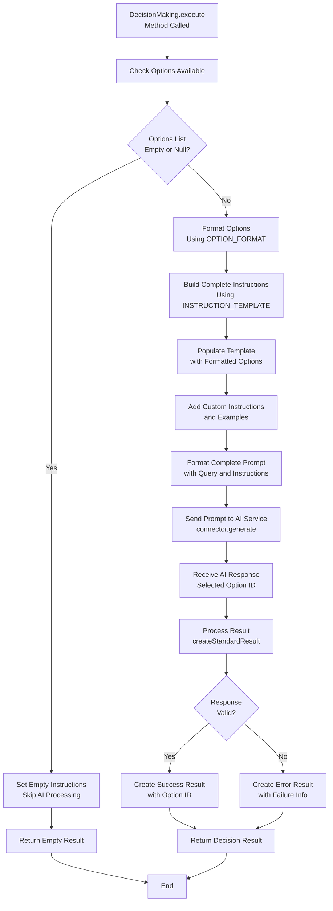

# DecisionMaking AI Function

## Concept of Decision Making AI Function

The `DecisionMaking` class is an AI function that automates decision-making processes by analyzing input queries and selecting the most appropriate option from a predefined list. It transforms complex decision logic into AI-powered analysis, making it essential for intelligent routing, condition evaluation, and automated choice selection.

### How It Works - Step-by-Step Process

1. **Option Definition**
   - Define available decision options with unique IDs
   - Set clear conditions for each option
   - Configure the decision space for AI analysis

2. **Instruction Building**
   - Format options into readable decision criteria
   - Generate structured prompts for AI evaluation
   - Include custom instructions to guide decision logic

3. **AI Analysis**
   - Send formatted decision prompt to AI service connector
   - AI analyzes query against all available options
   - Receive decision recommendation as option ID

4. **Result Processing**
   - Extract selected option ID from AI response
   - Validate the chosen option exists in defined options
   - Return standardized result with decision outcome

5. **Decision Execution**
   - Process the AI's choice for further action
   - Use selected option ID for routing or processing
   - Handle decision outcomes in application logic

## Field Explanations

### Core Fields

| Field | Type | Purpose | Description |
|-------|------|---------|-------------|
| `options` | List&lt;AiOption&gt; | Decision Space | List of available options for AI to choose from |
| `INSTRUCTION_TEMPLATE` | String | AI Guidance | Template that structures how options are presented to AI |
| `OPTION_FORMAT` | String | Formatting | Template for formatting individual options in readable format |

### Option Structure (AiOption)

| Field | Type | Purpose | Description |
|-------|------|---------|-------------|
| `id` | String | Unique Identifier | Unique identifier for the option (returned by AI) |
| `condition` | String | Decision Criteria | Human-readable condition describing when this option applies |

### Inherited Fields (from AiFunction)

| Field | Type | Purpose |
|-------|------|---------|
| `query` | String | Input to analyze for decision |
| `connector` | AbstractAiServiceConnector | AI service connection |
| `customInstructions` | List&lt;String&gt; | Additional decision guidance |
| `examples` | List&lt;AiExample&gt; | Example decisions for AI training |

## Option Management

The DecisionMaking function operates on a simple but powerful option-based approach:

### Option Definition

Each option consists of two key components:

```java
AiOption option = new AiOption();
option.setId("ESCALATE_TO_SUPERVISOR");
option.setCondition("Customer complaint is complex and requires management intervention");
```

### Option Formatting for AI

Options are automatically formatted into a readable structure:

```
- ID: ESCALATE_TO_SUPERVISOR
  condition: Customer complaint is complex and requires management intervention

- ID: RESOLVE_DIRECTLY
  condition: Issue can be handled by first-level support

- ID: REQUEST_MORE_INFO
  condition: Insufficient information to make a decision
```

### Best Practices for Options

**Option ID Guidelines:**
- Use clear, descriptive identifiers
- Follow consistent naming conventions (e.g., ACTION_VERB_OBJECT)
- Keep IDs concise but meaningful
- Use uppercase with underscores for readability

**Condition Guidelines:**
- Write clear, specific conditions
- Avoid ambiguous or overlapping criteria
- Include relevant context and parameters
- Use natural language that AI can easily understand

**Example Good Options:**

```java
// Customer Service Routing
new AiOption("TECHNICAL_SUPPORT", "Technical issue requiring specialized knowledge")
new AiOption("BILLING_INQUIRY", "Questions about charges, payments, or account balance")
new AiOption("GENERAL_INQUIRY", "Basic information requests or simple questions")

// Document Processing
new AiOption("APPROVE_DOCUMENT", "Document meets all requirements and standards")
new AiOption("REQUEST_REVISION", "Document has minor issues requiring updates")
new AiOption("REJECT_DOCUMENT", "Document fails to meet minimum requirements")
```

## Builder Details

The `DecisionMaking.Builder` class provides a fluent interface for configuring DecisionMaking instances:

### Core Configuration Methods

```java
// Basic setup
DecisionMaking.getBuilder()
    .useService(aiConnector)           // Set AI service
    .withQuery("analyze this request") // Set input to analyze
    .addOptions(optionsList)          // Define available choices
```

### Option Configuration

```java
// Add multiple options at once
.addOptions(Arrays.asList(
    new AiOption("OPTION_A", "Condition for choice A"),
    new AiOption("OPTION_B", "Condition for choice B"),
    new AiOption("OPTION_C", "Condition for choice C")
))

// Add options individually (if extending builder)
List<AiOption> options = new ArrayList<>();
options.add(new AiOption("PRIORITY_HIGH", "Urgent issue requiring immediate attention"));
options.add(new AiOption("PRIORITY_MEDIUM", "Important issue that can wait 24 hours"));
options.add(new AiOption("PRIORITY_LOW", "Non-urgent issue for normal queue"));

.addOptions(options)
```

### Advanced Configuration

```java
// Additional guidance for AI
.addCustomInstruction("Consider urgency and customer tier when deciding")
.addCustomInstructions(instructionList)

// Examples for AI training
.addExamples(Arrays.asList(
    new AiExample(
        "Server is down and customers cannot access the service",
        "PRIORITY_HIGH"
    ),
    new AiExample(
        "User wants to update their profile information",
        "PRIORITY_LOW"
    )
))
```

### Complete Builder Example

```java
// Comprehensive decision maker setup
DecisionMaking decisionMaker = DecisionMaking.getBuilder()
    .useService(aiServiceConnector)
    .withQuery("Customer reports: 'I can't log into my account and have an important meeting in 2 hours'")
    .addOptions(Arrays.asList(
        new AiOption("ESCALATE_URGENT", "Critical issue affecting business operations"),
        new AiOption("STANDARD_SUPPORT", "Regular support issue during business hours"),
        new AiOption("SELF_SERVICE", "Issue can be resolved with documentation")
    ))
    .addCustomInstruction("Prioritize based on business impact and time sensitivity")
    .addCustomInstruction("Consider customer tier and urgency indicators")
    .build();
```

## Instruction Building

The instruction building process creates structured prompts that present options clearly to the AI model:

### Instruction Template Structure

The `INSTRUCTION_TEMPLATE` provides the core framework:

```java
private static final String INSTRUCTION_TEMPLATE = """
    Options:
        {{options}}

    - an option is an ID - condition pair
    - analyze the query, choose the most suitable option
    - the result MUST be the ID of the chosen option
    """;
```

### Option Formatting

Each option is formatted using `OPTION_FORMAT`:

```java
private static final String OPTION_FORMAT = """
    - ID: %s
      condition: %s

    """;
```

### Complete Instruction Assembly

The DecisionMaking function builds comprehensive prompts by combining multiple instruction components. Here's how the complete instruction is assembled:

**Assembly Process:**

1. **Option Formatting**: Each AiOption is formatted using the OPTION_FORMAT template
2. **Template Population**: All formatted options are inserted into INSTRUCTION_TEMPLATE
3. **Custom Instructions**: Additional instructions are appended
4. **Final Prompt**: Complete prompt is sent to AI service

**Step-by-Step Assembly Example:**

```java
// Setup DecisionMaking
DecisionMaking.getBuilder()
    .withQuery("Customer says: 'My payment failed but money was deducted from my account'")
    .addOptions(Arrays.asList(
        new AiOption("REFUND_PROCESS", "Payment failed but charge occurred - needs refund"),
        new AiOption("ACCOUNT_INQUIRY", "Question about account balance or transaction history"),
        new AiOption("TECHNICAL_ISSUE", "System error or technical problem with payment processing"),
        new AiOption("BILLING_DISPUTE", "Customer disputes a charge or billing amount")
    ))
    .addCustomInstruction("Focus on the core issue: failed payment with money deducted")
    .addCustomInstruction("Prioritize customer's immediate financial concern")
    .build();
```

**Generated Complete Prompt:**

```plain
Query:
Customer says: 'My payment failed but money was deducted from my account'
-------------------------------
Instruction:
Options:
    - ID: REFUND_PROCESS
      condition: Payment failed but charge occurred - needs refund

    - ID: ACCOUNT_INQUIRY
      condition: Question about account balance or transaction history

    - ID: TECHNICAL_ISSUE
      condition: System error or technical problem with payment processing

    - ID: BILLING_DISPUTE
      condition: Customer disputes a charge or billing amount


- an option is an ID - condition pair
- analyze the query, choose the most suitable option
- the result MUST be the ID of the chosen option

- Focus on the core issue: failed payment with money deducted
- Prioritize customer's immediate financial concern
```

**Key Instruction Components:**

1. **Query Section**: The input text to analyze for decision-making
2. **Options Section**: Formatted list of all available choices with conditions
3. **Analysis Instructions**: Clear guidance on how to evaluate and choose
4. **Result Format**: Explicit instruction to return only the option ID
5. **Custom Instructions**: Additional context-specific guidance

### Empty Options Handling

When no options are provided, the function handles gracefully:

```java
// If there is no decision to make, just return the empty instruction
if (options == null || options.isEmpty()) {
    setFunctionInstructions(StringUtils.EMPTY);
    return;
}
```

## Executing

The execution process follows a straightforward flow focused on option analysis and selection:

### Execution Flow Diagram



### Basic Execution Flow

```java
@Override
public AiVariable execute() {
    // Build instructions with options
    buildInstructions();
    
    // Execute using parent AiFunction logic
    return super.execute();
}
```

### Instruction Building Process

```java
@Override
protected void buildInstructions() {
    // Handle empty options case
    if (options == null || options.isEmpty()) {
        setFunctionInstructions(StringUtils.EMPTY);
        return;
    }

    // Format options and build instructions
    Map<String, Object> params = new HashMap<>();
    params.put("options", formatOptions());
    setFunctionInstructions(PromptTemplate.from(INSTRUCTION_TEMPLATE).apply(params).text());
}
```

### Option Formatting Implementation

```java
private String formatOptions() {
    String result = StringUtils.EMPTY;
    for (var option : options) {
        // Build line of option using format template
        String line = String.format(OPTION_FORMAT, option.getId(), option.getCondition());
        
        // Append to the result
        result = result.concat(line);
    }
    return result;
}
```

## Result Processing

Result processing in DecisionMaking is streamlined compared to DataMapping, focusing on extracting and validating the chosen option ID:

### Standard Result Creation

```java
@Override
protected AiVariable createStandardResult(String resultFromAI) {
    // Handle empty or blank responses
    if (StringUtils.isBlank(resultFromAI)) {
        return buildErrorResult();
    }
    
    // Create successful result with AI's choice
    AiVariable result = new AiVariable();
    result.init();
    result.setContent(resultFromAI);
    result.setState(AiVariableState.SUCCESS);
    return result;
}
```

### Result Content Format

The AI is expected to return only the option ID:

```java
// Expected AI response examples:
"REFUND_PROCESS"
"TECHNICAL_ISSUE" 
"ESCALATE_URGENT"
```

### Error Handling

The function handles various error scenarios:

**Empty Response Handling:**
- Blank or null AI responses trigger error result
- Uses inherited `buildErrorResult()` from AiFunction

**Invalid Option ID:**
- While not explicitly validated in current implementation
- Calling code should verify returned ID exists in original options

**Processing Failures:**
- AI service connectivity issues handled by parent AiFunction
- Instruction building failures result in empty instructions

### Best Practices for Result Processing

1. **Validate Returned IDs**: Always check that AI returned a valid option ID
2. **Handle Edge Cases**: Prepare for unexpected AI responses
3. **Logging**: Log decision outcomes for audit and debugging
4. **Fallback Logic**: Have default options for unclear decisions

**Example Result Validation:**

```java
// Execute decision making
AiVariable result = decisionMaker.execute();

if (result.getState() == AiVariableState.SUCCESS) {
    String chosenOptionId = result.getContent();
    
    // Validate the choice exists in your options
    boolean validChoice = options.stream()
        .anyMatch(option -> option.getId().equals(chosenOptionId));
    
    if (validChoice) {
        // Process the valid decision
        processDecision(chosenOptionId);
    } else {
        // Handle invalid AI response
        handleInvalidDecision(chosenOptionId);
    }
} else {
    // Handle decision making failure
    handleDecisionFailure(result);
}
```

### Integration with Business Logic

The DecisionMaking result typically drives subsequent business logic:

```java
// Example: Customer service routing
switch (result.getContent()) {
    case "TECHNICAL_SUPPORT":
        routeToTechnicalTeam(customerRequest);
        break;
    case "BILLING_INQUIRY":
        routeToBillingDepartment(customerRequest);
        break;
    case "ESCALATE_URGENT":
        escalateToSupervisor(customerRequest);
        break;
    default:
        handleUnknownDecision(result.getContent());
}
``` 