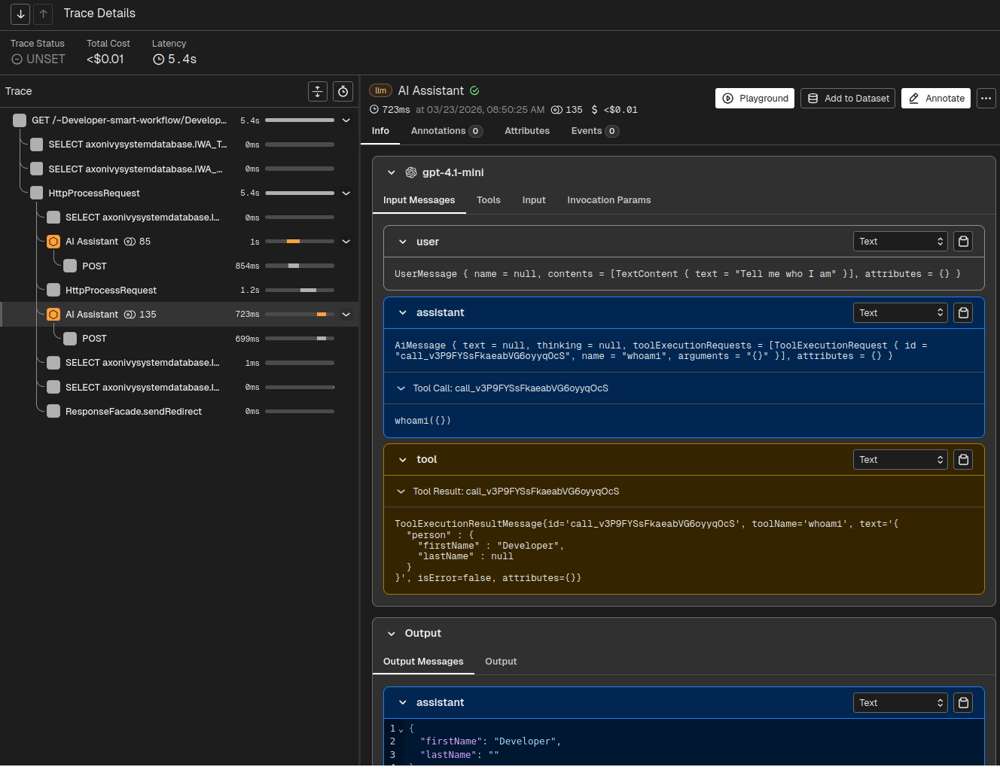
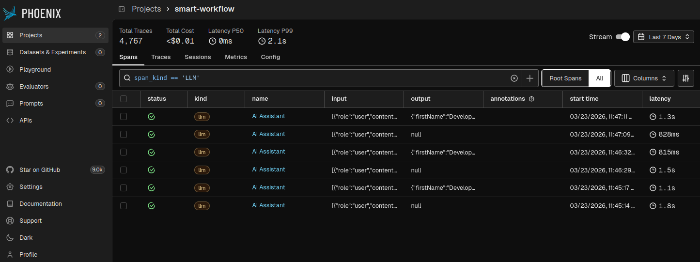

# Observability

In AI assisted adaptive process initiatives its crucial to observe execution paths of the AI agents.
With observation tools you remain in control of spent costs, used models and processed data.

## Tracing with Arize Phoenix

Arize Phoenix is a tracing platform that collects Agent metrics from the Axon Ivy Engine.
It provides a rich user-interface to oversee interactions of the users with AI Models, Tool calls,
Token costs and more. In addition, it allows you to re-play real requests with alternative models or prompts.

### Setup Arize Phoenix

1. Run Arize Phoenix using Docker: `docker run --rm -p 6006:6006 -p 4317:4317 arizephoenix/phoenix:nightly`
2. Visit the tracing platform in your browser [http://localhost:6006](http://localhost:6006)

### Setup Engine

1. Download and unpack a normal Axon Ivy Engine, which we will instrument for tracing
2. Download the [opentelemetry-javaagent.jar](https://repo1.maven.org/maven2/io/opentelemetry/javaagent/opentelemetry-javaagent/2.25.0/opentelemetry-javaagent-2.25.0.jar) and store it in the engine root
3. Copy the [opentelemetry.properties](./opentelemetry.properties) into the engine `configuration/opentelemetry.properties`
3. Append the [jvm.options](./jvm.options) into the engine file `configuration/jvm.options`
4. Adjust the paths in the jvm.options; replace __DIR__ with the engine directory
5. Adjust the ch.ivyteam.ivy.tracing.jar; replace __VERSION__ with the current jar file shipped with the engine
6. Set the variable `AI.Observability.Openinference.Enabled=true` in the `config/variables.yaml` of a project depending on smart-workflow.
7. Start the Engine

### Setup Visual Studio Code

1. Install the Axon Ivy Designer extension
2. Go to settings and disable "Run Engine by Extension"
3. Restart Visual Studio Code (Command > Developer: Reload Window)
4. Run an AI assisted process in smart-workflow-demo

### Querying

To query costs, models or prompts from past AI assistant runs open Arize Phoenix in your browser [http://localhost:6006](http://localhost:6006).
1. Click on the "smart-workflow" project
2. Enter filter condition `span_kind == 'LLM'`
3. Switch to from `Root Spans` to `All` next to the filter bar

