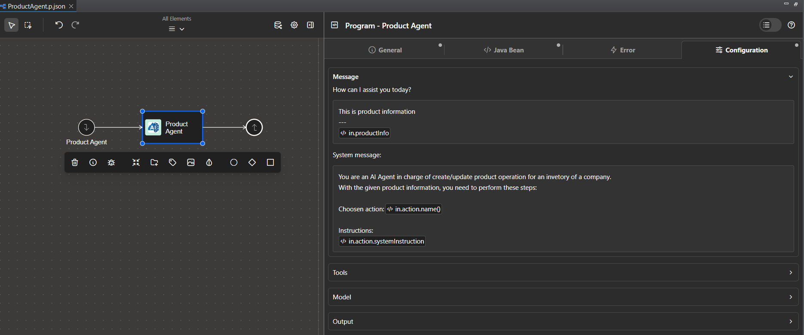
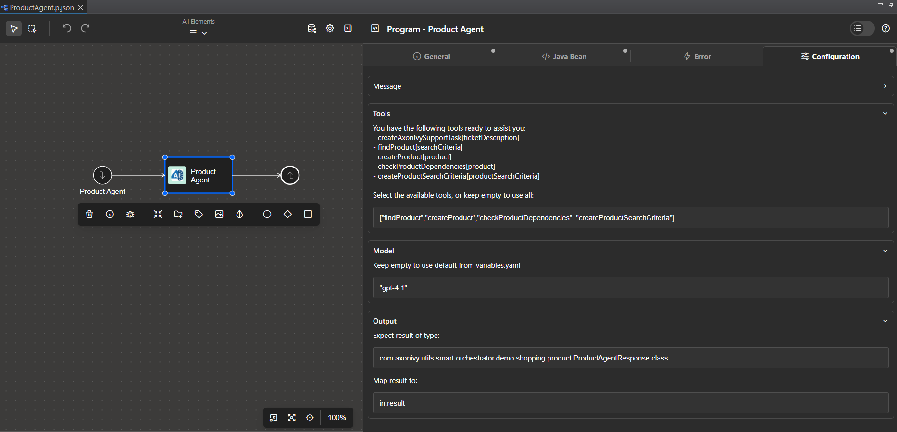

# Agent Setup

`AgenticProcessCall` is the process element that puts an AI agent step inside a process. You declare what to ask, what data to pass in, and where the answer goes; the element handles the model call.

Add it from **Extension > Program Elements** in the Designer, then double-click to configure.

## Prerequisites

An agent needs a model provider and a key before it can run — at minimum `AI.DefaultProvider` and that provider's `APIKey`. See [Model Providers](providers.md) for every provider's configuration block and how keys are handled, or [Getting Started](../getting-started.md) if you have not set one up yet.

## Element configuration

The editor is organized in five groups.

### Message

| Field | Purpose |
| --- | --- |
| `System message` | The agent's standing instructions — who it is, what it must do, what format to produce. |
| `User message` | The data to reason over on this call. |



Both fields are multi-line, and both accept `<%=...%>` to inject process data. Anything you can reach from IvyScript can go into either message.

A good system message is specific: the model knows nothing about your business, so state what to do, what to leave out, and what shape to return. Use `<%=...%>` for anything that should not be hard-coded into the element — company policy, the current department, an approval threshold:

```text
You are a purchase request assistant for <%=in.companyName%>.

Follow these company policies at all times:
<%=in.policyText%>

Approve requests below <%=in.autoApproveLimit%> without asking.
Anything above that must go to a human approver.
Return a single sentence with the decision and the reason, and nothing else.
```

Where those values come from is up to the process — a CMS entry, an Ivy variable, a read from an earlier step. A policy change then updates one source instead of every agent in the application.

The user message is usually a straight reference to a process data field:

```text
<%=in.invoiceText%>
```

The two fields differ in one way, and it only matters for files:

- **User message** — an expression that resolves to a file becomes image or PDF content. This is the field that supports [file extraction](file-extraction.md).
- **System message** — every expression becomes text. Files are not handled here.

If you run into trouble crafting these messages, [Messages and expressions](../troubleshooting.md#messages-and-expressions) covers what usually causes it.

### Tools

`Available tools` lists the tools an agent can use — both callable sub-processes tagged `tool` and Java tools registered via SPI.

> **Important:** An empty `Available tools` field means the agent has **no tools to use at all**. If your agent ignores a tool you expected it to call, check that the tool is actually selected here.

See [Defining Tools](tools.md) for writing tools and for how their descriptions reach the model.

### Guardrails

`Input guardrails` and `Output guardrails` are pickers over the registered guardrails.

By default, Smart Workflow applies the guardrails configured for the application — `AI.Guardrails.DefaultInput` and `AI.Guardrails.DefaultOutput`. Every agent is protected without anything being set on the element.

To give one agent a different set, select them in these pickers; what you select replaces the defaults for that agent. Leave the fields empty to keep the application defaults.

> **Note:** Because empty means "use the defaults" rather than "no guardrails", an agent you never configured still runs whatever the application set. Worth remembering in tests, where a global input guardrail can reject fixture data.

See [Guardrails](../operate/guardrails.md).

### Model

| Field | Notes |
| --- | --- |
| `Provider` | Empty falls back to `AI.DefaultProvider`. |
| `Model` | A script field returning `String`, so quote it: `"gpt-4o"`. Empty falls back to the provider's `DefaultModel`. |

`Model` being a script field is easy to trip over — a bare `gpt-4o` will not compile. See [Model Providers](providers.md#per-agent-override) for the full resolution order and per-provider model names.

### Output

| Field | Notes |
| --- | --- |
| `Expect result of type` | A script field returning a `Class`. Leave empty for a plain `String`. |
| `Map result to` | Where the result is written, e.g. `in.summary`. |



By default an agent returns plain text, and no output configuration is needed at all. Setting `Map result to` to `in.summary` writes the response into the `summary` field of the process data — a `String`, ready to display, log, or pass on. No parsing, no casting.

If the mapped field stays empty after a run, [Troubleshooting](../troubleshooting.md#the-agent-did-not-answer) covers the usual cause.

## Structured output

To get a typed object instead of a string, set `Expect result of type` to the class you want back:

```java
com.axonivy.utils.ai.Invoice.class
```

LangChain4j derives a JSON schema from the class, sends it to the model as a response-format constraint, and deserializes the reply into an instance. The rest of the process then reads typed fields directly:

```java
in.result.invoiceNumber
in.result.totalAmount
```

Field names are what the model sees, so name them the way you would describe them: `invoiceNumber`, `totalAmount`, `invoiceDate`. A clear name is worth more than a line of prompt.

The field is a script expression that must evaluate to a `java.lang.Class`. `MyClass.class` is the usual way to write that, but any expression returning a `Class` works — including a variable, which is how the Portal bridge passes a caller-chosen type:

```java
in.resultType
```

> **Important:** A bare collection is not a supported output type. To return a list, wrap it in a composite object that has the list as a field.

Both Ivy data classes and plain Java classes work, as long as the class is on the runtime classpath.

Structured output is the one area where providers differ enough to change your design — Gemini does not support it at all, and Ollama drops the schema when the agent also has tools. Check [Provider Capabilities](../reference/capabilities.md#structured-output) before you rely on it.

## Example

A minimal text agent, start to finish:

**System message:**

```text
You are an invoice summary agent.
Read the invoice text and return a single sentence containing
the invoice number, supplier name, total amount, and due date.
Do not add any other commentary.
```

| Field | Value |
| --- | --- |
| `User message` | `<%=in.invoiceText%>` |
| `Expect result of type` | _(empty — plain `String`)_ |
| `Map result to` | `in.summary` |

To turn the same agent into a typed extractor, set `Expect result of type` to `com.axonivy.utils.ai.Invoice.class` and describe the fields in the system message. [File Extraction](file-extraction.md#example) has that version in full, reading the invoice from a document rather than from text.

For working implementations, see the [demo processes](https://github.com/axonivy-market/smart-workflow/blob/master/smart-workflow-demo/process/) — `AgentDemo/SupportAgent.p.json` for a tool-using agent and `Features/FileExtractionDemo.p.json` for typed extraction.

## See also

- [Model Providers](providers.md) — choosing and configuring a provider
- [Defining Tools](tools.md) — giving an agent something to do
- [Guardrails](../operate/guardrails.md) — validating input and output
- [File Extraction](file-extraction.md) — images and PDFs as input
- [Human in the Loop](human-in-the-loop.md) — suspending an agent for a human decision
- [Agent Patterns](patterns.md) — structuring several agents in one process
- [Troubleshooting](../troubleshooting.md) — when an agent does not answer, or answers wrongly
