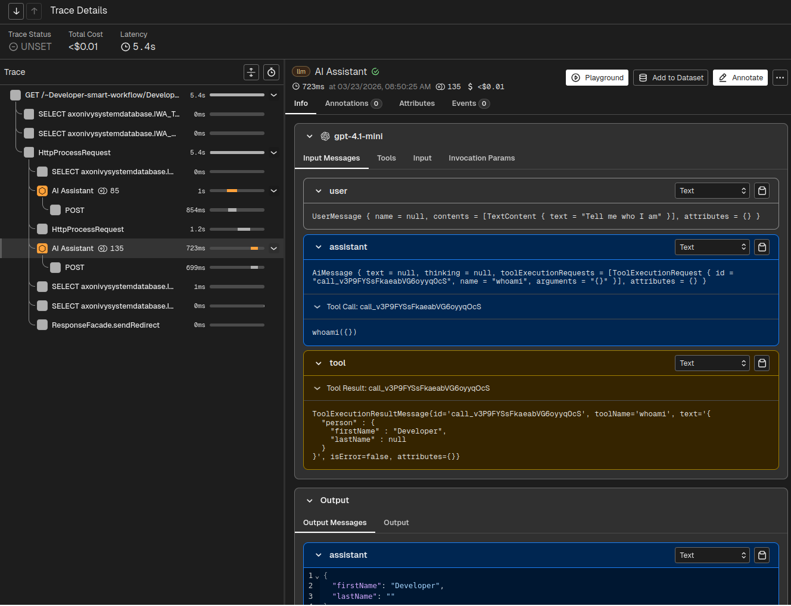
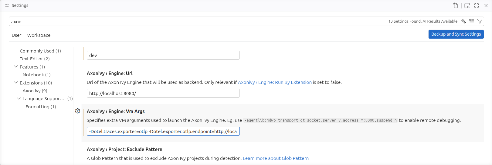
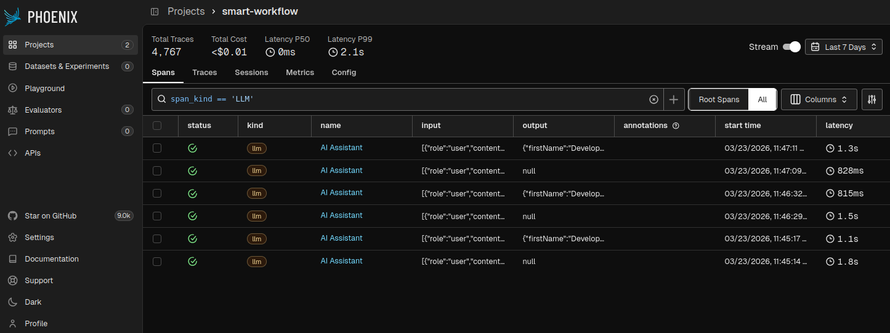

# Observability

In AI-assisted adaptive process initiatives, it's crucial to observe execution paths of the AI agents. With observation tools you remain in control of spent costs, used models and processed data.

Observability is configured at **application level** and applies to every agent automatically — there is nothing to enable per element and no code to write. Smart Workflow offers three independent channels, each with its own switch:

| Channel | Variable | Default |
| --- | --- | --- |
| [Arize Phoenix tracing](#tracing-with-arize-phoenix) | `AI.Observability.Openinference.Enabled` | off |
| [Ivy conversation history](#conversation-history-in-ivy) | `AI.Observability.Ivy.Enabled` | off |
| [AI-assisted custom fields](#ai-assisted-custom-fields) | `AI.Observability.CustomFields.Enabled` | on |

## Tracing with Arize Phoenix

Arize Phoenix is a tracing platform that collects Agent metrics from the Axon Ivy Engine. It provides a rich user-interface to oversee interactions of the users with AI Models, Tool calls, Token costs and more. In addition, it allows you to re-play real requests with alternative models or prompts.



### Setup

#### Arize Phoenix

1. Run Arize Phoenix using Docker: `docker run --rm -p 6006:6006 -p 4317:4317 arizephoenix/phoenix:nightly`

   Alternatively, create a `compose.yml` with the following content and start it with `docker compose up`:

   ```yaml
   services:
     phoenix:
       image: arizephoenix/phoenix:nightly
       ports:
         - "6006:6006"
         - "4317:4317"
   ```

2. Visit the tracing platform in your browser [http://localhost:6006](http://localhost:6006)

#### Visual Studio Code

1. Install the Axon Ivy Designer extension
2. Open the Settings and search for Axon Ivy, in it define:
    - `AxonIvy > Engine: VM args` : `-Dotel.traces.exporter=otlp -Dotel.exporter.otlp.endpoint=http://localhost:6006 -Dotel.resource.attributes=openinference.project.name=smart-workflow`

   Alternatively, put these options into the `configuration/jvm.options` of your Engine:

   ```properties
   # OpenTelemetry -> Arize Phoenix
   -Dotel.traces.exporter=otlp
   -Dotel.exporter.otlp.endpoint=http://localhost:6006
   -Dotel.resource.attributes=openinference.project.name=smart-workflow

   # Run Engine in VSCode dev mode
   -Ddev.mode=true
   ```

3. Restart Visual Studio Code (Command > Developer: Reload Window)
4. Set the variable `AI.Observability.Openinference.Enabled` to `true` in the Engine Cockpit, under **Variables**.
5. Run an AI assisted process in smart-workflow-demo



#### Dev container

The Smart Workflow [dev container](https://github.com/axonivy-market/smart-workflow/blob/master/doc/dev/DEVCONTAINER.md) is pre-configured to run Arize Phoenix within your codespace. In that environment you only need to define the AI provider API key. Processes that you run report to Arize Phoenix automatically, and you can inspect the traces on the exposed container port 6006.

### Querying

To query costs, models or prompts from past AI assistant runs open Arize Phoenix in your browser [http://localhost:6006](http://localhost:6006).

1. Click on the "smart-workflow" project
2. Enter filter condition `span_kind == 'LLM'`
3. Switch from `Root Spans` to `All` next to the filter bar



#### Filters

If you like to dig deeper, note that it's possible to track AI interactions over a complete Case or Task. You can reveal them by adding a filter, expressing the UUID of the Case respectively the Task.

- Case with UUID 6407c9bd-be10-4334-9ca9-c9b846fc1f57:

  `span_kind == 'LLM' and ivy.case == '6407c9bd-be10-4334-9ca9-c9b846fc1f57'`

- Task with UUID 2afa6db6-35d6-4f72-af05-711963888b0b:

  `span_kind == 'LLM' and ivy.task == '2afa6db6-35d6-4f72-af05-711963888b0b'`

#### Redacting message content

Traces include the full prompt and response by default. Where that is too sensitive to export, suppress either side while keeping the timing, cost and model metadata:

```yaml
Variables:
  AI:
    Observability:
      Openinference:
        Enabled: "true"
        HideInputMessages: "true"
        HideOutputMessages: "true"
```

This is a coarser tool than [PII masking](guardrails.md#pii-masking): it removes the content from the trace rather than from the model request.

## Conversation history in Ivy

Independently of Arize Phoenix, Smart Workflow can record every agent conversation into the Ivy repository for governance audit. This needs no external platform — the records are queryable from Ivy itself and are visible in the agent history tree.

Enable it in the **Engine Cockpit**, under **Variables**:

```yaml
Variables:
  AI:
    Observability:
      Ivy:
        # Enable chat history recording for governance audit.
        Enabled: "true"
```

Each conversation is recorded against the current Case and Task, under the agent's element name, and captures four kinds of entry:

- **Agent responses** — what the model returned
- **Tool executions** — which tools ran, with their arguments and results
- **Input guardrail** evaluations
- **Output guardrail** evaluations

> **Note:** This is a durable audit record of prompts, responses and tool arguments. Treat it as such when deciding retention, and prefer [PII masking](guardrails.md#pii-masking) over redaction after the fact. See [Security and Data](security-and-data.md).

## Guardrail records

Guardrail executions appear in both channels, with their own fields.

**In the Ivy conversation history**, each guardrail execution is stored alongside tool executions in the `AgentConversationEntry`:

| Field | Meaning |
| --- | --- |
| `guardrailName` | The guardrail class name |
| `type` | `INPUT` or `OUTPUT` |
| `result` | `SUCCESS`, `FAILURE`, or `FATAL` |
| `message` | The validated content — user query for input, AI response for output |
| `failureMessage` | The reason when a guardrail blocks; null on success |
| `durationMs` | Execution time in milliseconds |
| `executedAt` | Timestamp of execution |

**In Arize Phoenix**, each guardrail execution produces a dedicated span with `openinference.span.kind = "GUARDRAIL"`, appearing alongside the LLM spans so a trace shows the complete interaction including safety checks:

| Attribute | Description |
| --- | --- |
| `openinference.span.kind` | `GUARDRAIL` |
| `validator_name` | The guardrail class name (Phoenix convention) |
| `validator_on_fail` | Behaviour on failure — always `"exception"` |
| `guardrail.type` | `INPUT` or `OUTPUT` |
| `guardrail.result` | `SUCCESS`, `FAILURE`, or `FATAL` |
| `guardrail.failure_message` | Failure reason, present only when blocked |
| `input.value` | The validated content |
| `output.value` | `"pass"` or `"fail"` (Phoenix convention) |

The [circuit breaker](circuit-breaker.md) participates in this like any other guardrail: a stopped call is recorded under the guardrail name `CircuitBreakerGuardrail`, with the stop reason as its failure message.

## AI-assisted custom fields

Smart Workflow automatically marks Cases and Tasks with a custom field when an AI agent is invoked during their execution. This provides a lightweight, built-in way to track AI usage directly on workflow entities without requiring an external tracing platform.

| Field key | Type | Label | Scope |
| --- | --- | --- | --- |
| `aiAssisted` | STRING | AI-assisted | Task, Case |

The field is set to `SMART_WORKFLOW` when the AI agent is used within the context of a Task or Case.

This is the one observability channel that is **on by default**. To disable it, set `AI.Observability.CustomFields.Enabled` to `false` in the Engine Cockpit.

## See also

- [Guardrails](guardrails.md) — what produces the guardrail records above
- [Circuit Breaker](circuit-breaker.md) — confirming afterwards which calls were stopped
- [Security and Data](security-and-data.md) — what these records mean for retention
- [Variables](../reference/variables.md) — every observability switch
