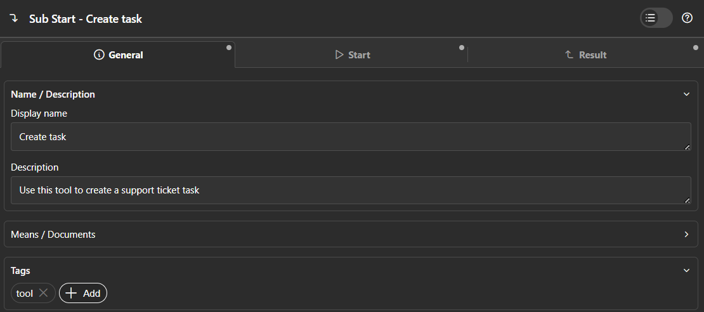

# Defining Tools

AI agents in Smart Workflow use tools to take action. A tool is a named, callable unit of logic that the agent discovers, selects, and invokes at runtime. Smart Workflow supports two kinds of tools.


## Callable process tools

We strongly encourage using callable subprocesses as tools. This approach aligns naturally with how Ivy developers already work and provides full access to the power of the process designer—such as error handling, dialogs, subprocess calls, and other Axon Ivy capabilities.

You can turn any callable subprocess into a tool by simply adding the `tool` tag.

**Steps:**

1. Create a callable sub-process in your Axon Ivy project.
2. Add the tag `tool` to the `CallSubStart`.
3. Write a clear `description` — this is what the agent reads to decide whether to call the tool.



Discovery covers the current project **and all required projects**, so a tool defined in a shared base project is available to agents in every project that depends on it.

### What the agent actually sees

Only two things from the process definition reach the model:

| Source | Becomes |
| --- | --- |
| The `CallSubStart` description | The tool description — what it does, when to use it |
| Each **input** parameter's name, type and description | The tool's parameter schema |

> **Important:** Descriptions on **result** parameters are not sent to the model. They are useful documentation for the next developer, but they play no part in the tool contract — the agent only learns what a tool returns by receiving the result, which is handed back as raw JSON.

That makes the input parameter descriptions the highest-leverage text you write. A parameter called `id` with no description is a guess; `id` described as "the supplier number as printed on the invoice, without the country prefix" is not.

### Selecting tools on the agent

Tools are discovered globally but granted per agent, via the `Available tools` picker in the element's **Tools** group.

> **Important:** An empty `Available tools` field means the agent has **no tools to use at all**. This is the usual reason an agent explains what it would do instead of doing it.

Keep the list tight. Every tool you grant costs tokens in the request and gives the model one more way to pick wrong.


## Java tools

For advanced use cases, tool logic can also be implemented directly in Java. This is rarely needed — prefer callable processes whenever possible. Consider Java Tools only when the logic has no workflow steps and is better expressed as a plain Java class.

Two interfaces are involved, both under `com.axonivy.utils.smart.workflow.tools.provider`:

```java
public interface SmartWorkflowTool {
  record ToolParameter(String name, String description, String type) {}

  String description();
  List<ToolParameter> parameters();
  Object execute(Map<String, Object> args);

  default String name() { return getClass().getSimpleName(); }
}

public interface SmartWorkflowToolsProvider {
  List<SmartWorkflowTool> getTools();

  default String name() { return getClass().getSimpleName(); }
}
```

`description()` and each parameter's name, type and description are what the model sees. Arguments are deserialized into the declared type automatically, and whatever you return is serialized back to the agent as JSON.

### Step 1 — Implement `SmartWorkflowTool`

```java
public class MyTool implements SmartWorkflowTool {

  @Override
  public String name() {
    return "myTool"; // name the agent uses to call this tool
  }

  @Override
  public String description() {
    return "Describe what this tool does and when the agent should use it.";
  }

  @Override
  public List<ToolParameter> parameters() {
    return List.of(
        new ToolParameter("paramName", "description of this param", "java.lang.String")
    );
  }

  @Override
  public Object execute(Map<String, Object> args) {
    String value = (String) args.get("paramName");
    // ... your logic
    return result;
  }
}
```

The type is a string identifying the Java type. The following kinds are supported:

| Kind | Example |
| --- | --- |
| Primitive | `"int"`, `"boolean"`, `"double"` |
| Java class | `"java.lang.String"`, `"com.example.MyClass"` |
| List | `"java.util.List<java.lang.String>"`, `"java.util.List<com.example.MyClass>"` |

Arrays are not supported — use `List` instead.

The framework deserializes the agent's JSON arguments into the declared Java type automatically.

### Step 2 — Create a `SmartWorkflowToolsProvider`

Group one or more tools in a provider class:

```java
public class MyToolProvider implements SmartWorkflowToolsProvider {
  @Override
  public List<SmartWorkflowTool> getTools() {
    return List.of(new MyTool());
  }
}
```

### Step 3 — Register via SPI

Create the file `src/META-INF/services/com.axonivy.utils.smart.workflow.tools.provider.SmartWorkflowToolsProvider` and the tool provider:

```text
com.example.MyToolProvider
```

Providers are resolved on each agent call, not cached at startup, so a newly registered tool is picked up without a restart.

> **Note:** Only the **first line** of a services file is read. To register two providers, use two files — a second class name listed in the same file is silently ignored.

`name()` is optional on both `SmartWorkflowTool` and `SmartWorkflowToolsProvider`; it defaults to the simple class name. Override it on a tool when you want the agent-facing name to differ from the class name, as in the example above.


## Demo: `TaxCalculatorTool`

[`TaxCalculatorTool`](https://github.com/axonivy-market/smart-workflow/blob/master/smart-workflow-demo/src/com/axonivy/utils/smart/workflow/demo/tool/TaxCalculatorTool.java) shows a complete Java Tool that accepts a structured `Invoice` object and returns per-item tax calculations.

Key points from the demo:

- Uses a custom type (`com.axonivy.utils.ai.Invoice`) as a parameter — the framework deserializes it automatically from the agent's JSON call.
- Returns a typed result record (`TaxCalculationResult`) which the framework serializes back to the agent as JSON.
- Registered in [`DemoToolProvider`](https://github.com/axonivy-market/smart-workflow/blob/master/smart-workflow-demo/src/com/axonivy/utils/smart/workflow/demo/tool/DemoToolProvider.java) via SPI.


## Standard tools

Smart Workflow ships with built-in tools that agents can use out of the box.

### webSearch

Searches the web for current information and returns a list of results with titles, URLs, and content snippets.
Agents select this tool automatically when they need up-to-date or factual information from the internet.

**Configuration** (set in `variables.yaml`):

| Variable | Purpose | Shipped value |
| --- | --- | --- |
| `AI.Tool.WebSearch.Engine` | Name of the search engine to use. Must match the `name()` of a registered `SmartWebSearchEngine`. If empty, the first available engine is used. | `duckduckgo` |
| `AI.Tool.WebSearch.MaxResults` | Maximum number of search results returned per query. Empty falls back to `5`. | _(empty)_ |
| `AI.Tool.WebSearch.WhitelistDomains` | Comma-separated list of allowed domains (e.g. `stackoverflow.com, github.com`). If empty, all domains are allowed. | _(empty — all domains)_ |

**Search engine**: DuckDuckGo is the shipped default and the only built-in engine. Custom engines can be plugged in by implementing [`SmartWebSearchEngine`](https://github.com/axonivy-market/smart-workflow/blob/master/smart-workflow/src/com/axonivy/utils/smart/workflow/tools/web/SmartWebSearchEngine.java) and registering a [`SmartWebSearchEngineProvider`](https://github.com/axonivy-market/smart-workflow/blob/master/smart-workflow/src/com/axonivy/utils/smart/workflow/tools/web/SmartWebSearchEngineProvider.java) via SPI. Engine names are matched case-insensitively.

**Using the tool in a process**: select `webSearch` in the `Available tools` picker of the agent element.

Agents do not search unless the task calls for it, and a vague system message tends to produce an answer from training data instead. If you want the agent to look things up, say so — and if you want citations, ask for the source URLs explicitly, since they are in the result but the model will not volunteer them.

> **Note:** When the domain whitelist filters out every result, the tool returns an explanatory note alongside the empty result list, and that text goes to the model. An agent reporting that it found nothing may be hitting the whitelist rather than an empty web.

See the [`WebSearchDemo`](https://github.com/axonivy-market/smart-workflow/blob/master/smart-workflow-demo/process/Features/WebSearchDemo.p.json) process for a complete example.


## Common mistakes

- **Leaving `Available tools` empty.** The agent gets no tools. This is the usual reason an agent explains what it would do instead of doing it.
- **A parameter with no description.** The description is the whole contract — an undescribed `id` is a guess.
- **Documenting the result parameters.** Their descriptions never reach the model. Only input parameters and the `CallSubStart` description do.
- **Forgetting the `tool` tag** on the `CallSubStart`, so the tool never appears in the picker.
- **Two providers in one SPI services file.** Only the first line is read; use two files.
- **Granting every tool you have.** Each one costs tokens in every request and gives the model another way to choose wrong.

## See also

- [Agent Setup](agent-setup.md) — selecting tools on the agent element
- [Human in the Loop](human-in-the-loop.md) — a tool that suspends the agent for a human decision
- [RAG](rag.md) — the built-in `openSearchSearch` retrieval tool
- [Variables](reference/variables.md#web-search) — configuring `webSearch`
