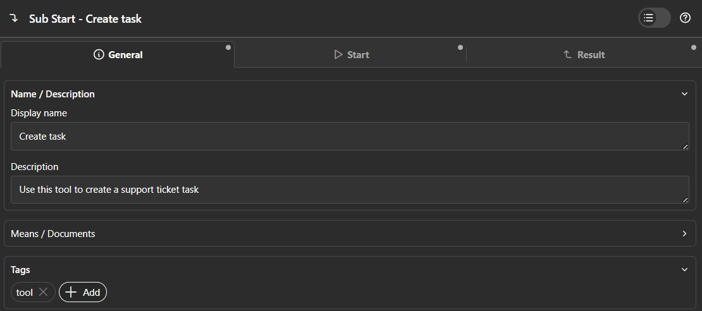
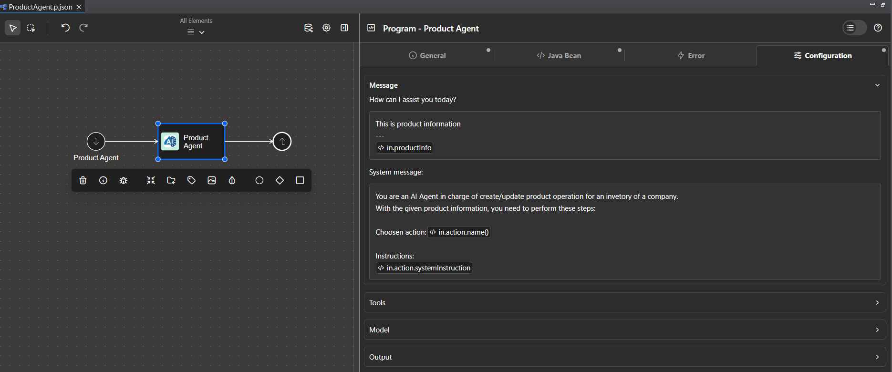
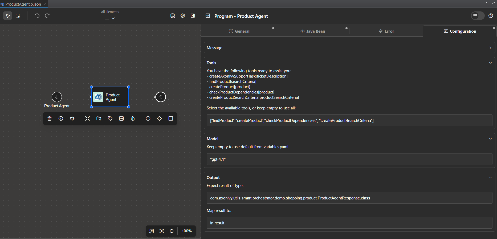

<!--
Dear developer!     

When you create your very valuable documentation, please be aware that this Readme.md is not only published on github. This documentation is also processed automatically and published on our website. For this to work, the two headings "Demo" and "Setup" must not be changed. Do also not change the order of the headings. Feel free to add sub-sections wherever you want.
-->

# Smart Workflow

**Smart Workflow** brings AI directly into Axon Ivy, so developers can build, run, and improve AI agents inside existing Axon processes. It lets business workflows leverage large language models to understand natural language, make autonomous decisions, and adapt to changing requirements — all without heavy architectural changes.

Key benefits of Smart Workflow:

- **Familiar setup:** Drop AI agents into BPMN processes with no structural changes and configure everything through Axon Ivy’s standard interfaces.

- **Enterprise-ready:** Built for enterprise needs with logging, monitoring, and configuration controls.

- **Flexible tools:** Turn any callable process into an AI-discoverable tool.

- **Multi-model support:** Use lightweight or advanced models depending on the task.

- **Type-safe outputs:** Produce structured Java objects from AI responses for immediate use.

- **Natural language handling:** Accept unstructured input and return human-friendly output.

## Demo

### Axon Ivy Support Agent Demo

This demo showcases how to use the Axon Ivy Support Agent, an AI-powered agent integrated into a business workflow. The agent is designed to classify support problems, check for missing information, and create support tasks automatically.

**Workflow Overview:**

1. **Input:** The agent receives a support question and the username of the reporter.
2. **Classification:** It analyzes the problem, determines if information is missing (such as version), and classifies the issue (Portal, Core, or Market product).
3. **Task Creation:** If necessary, the agent creates a support task using the `createAxonIvySupportTask` tool and provides a link to the created task.
4. **Summary & Response:** The agent summarizes the problem and replies to the user with a detailed response.

**Technical Details:**

- The agent is implemented as a callable sub-process (`AxonIvySupportAgent.p.json`) and uses the `com.axonivy.utils.smart.orchestrator.AgenticProcessCall` Java bean.
- The agent is configured to use a specific tool (`createAxonIvySupportTask`), which allows it to create support tasks automatically within the workflow. This is achieved by specifying the tool name in the agent's configuration (see example below).
- The agent's output is mapped to a structured Java object (`AxonIvySupportResponse`), making it easy to use the AI-generated result directly in Axon Ivy processes. This object typically contains details such as the classification, created task link, and a summary of the support issue.

**Agent Configuration Example:**

To configure the agent, define a program element with the following settings:

```java
javaClass: com.axonivy.utils.smart.orchestrator.AgenticProcessCall
userConfig:
  system: "Classify problem then create a task if necessary. Check for missing information like version, classify problem: Portal or Core or Market product, check create a task to handle it, return the task detail link, then summarize problem, reply to question."
  tools: ["createAxonIvySupportTask"]
  resultType: Business.AxonIvySupportDemo.AxonIvySupportResponse.class
  resultMapping: in.result
  query: <%=in.ticketDescription%>
```

This configuration ensures the agent uses only the specified tool and returns its output as a structured Java object.

**Demo Run Example:**

Suppose a user submits a support question: "The portal is not loading for user JohnDoe."

1. The agent receives the question and username.
2. It checks for missing information (e.g., version), classifies the issue as a Portal problem, and determines that a support task should be created.
3. The agent calls the `createAxonIvySupportTask` tool, which creates a new support task and returns a link to it.
4. The agent summarizes the problem and provides a response such as:

```text
Classification: Portal
Task Created: https://support.axonivy.com/task/12345
Summary: The portal is not loading for user JohnDoe. A support task has been created to investigate the issue.
```

This response is mapped to the `AxonIvySupportResponse` object and can be used directly in subsequent workflow steps.

How to Run the Demo:

1. Ensure you have completed the [Configurations](#configurations) section.
2. Trigger the Axon Ivy Support Agent process with a support question and username.
3. Review the agent's response, which includes classification, task creation (if needed), and a summary.

## Setup

### Configurations

Before start working with Smart Ochrestator, you need to provide some configurations using Axon Ivy variables:

- `AI.OpenAI.APIKey`: API key of your OpenAI account.
- `AI.OpenAI.Model`: Default OpenAI model. Currently we are supporting `gpt-4o`, `gpt-4.1`, `gpt-4.1-mini`, `gpt-4.1-nano`, and `gpt-5` models.

### Defining Tools with Callable Processes

To function effectively, AI agents require tools to perform tasks. With Smart Workflow, creating a tool is straightforward: simply define a callable process and add the `tool` tag to it.

To select the appropriate tool, AI agents rely on the descriptions of callable processes. To ensure efficient tool selection, clearly describe the tool's purpose in the `description` field.



### Defining AI agent

To define an AI agent, create a program element backed by the `com.axonivy.utils.smart.orchestrator.AgenticProcessCall` Java bean. In the `Configuration` tab, you can access and customize detailed settings for your AI agent.

#### Message

In the `Message` section, you can specify the user message and system message for the agent. By allowing code injection directly into these fields, Smart Workflow offers a convenient way for developers to define messages before they are sent to the AI service.



#### Tools

Below the `Messages` section is the `Tools` section, where you can define the set of tools the agent should use as a String array. For example:

```java
["findProduct","createProduct","checkProductDependencies", "createProductSearchCriteria"]
```

By default, if no tools are specified, Smart Workflow assumes the agent can use all available tools. Therefore, it is recommended to define a specific set of tools for each agent to improve response speed and prevent the use of inappropriate tools.

#### Model

Not all AI agents are created equal. In Axon Ivy, we recognize that AI agents handle tasks of varying complexity. Some agents perform simple tasks, such as creating leave requests or gathering user information, while others must search databases for products and evaluate dependencies like suppliers and brands. Therefore, Smart Workflow allows developers to select the underlying AI model based on the use case.

To do this, simply enter the desired AI model in the `Model` section. By default, if no model is specified, Smart Workflow uses the model defined in the variable `AI.OpenAI.Model`.

#### Output

For enterprise-level AI applications, it is common to require the AI agent’s result in the form of a usable object.
To address this need, the Smart Workflow AI agent can produce output as a Java object, ready to be used directly by Axon Ivy processes.

You can easily configure this by specifying both the expected result type and the target object to map the result to in the `Output` section.



### Enable AI activies logging

To monitor and manage AI activities, you can enable dedicated logging for Smart Workflow's AI agents.
This is done by modifying the default `configuration\log4j2.xml` file in your Designer or Engine installation as follows:

```xml
<?xml version="1.0" encoding="UTF-8"?>
<Configuration>
  <Appenders>
    <RollingRandomAccessFile name="AIlog" fileName="logs/ai.log" filePattern="logs/ai-%d{yyyy-MM-dd}.log.gz" ignoreExceptions="false">
      <PatternLayout pattern="${pattern}" />
      <TimeBasedTriggeringPolicy />
    </RollingRandomAccessFile>
  </Appenders>

  <Loggers>
    <Logger name="dev.langchain4j.http.client.log.LoggingHttpClient" level="trace" includeLocation="false" additivity="false">
      <AppenderRef ref="AIlog" />
      <AppenderRef ref="ConsoleLog" />
    </Logger>
  </Loggers>
</Configuration>
```

After restarting Axon Ivy, all AI activities will be recorded in the `logs/ai.log` file for easy tracking and analysis.
