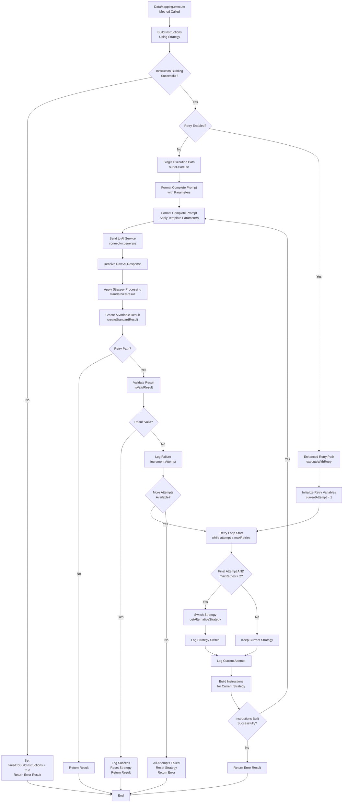
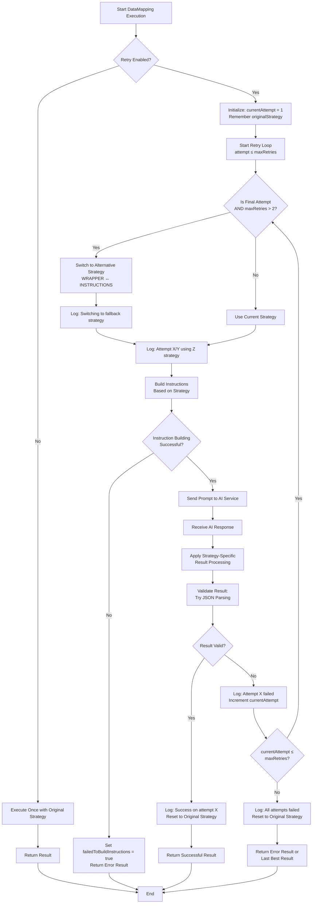

# DataMapping AI Function

## Concept of Data Mapping AI Function

The `DataMapping` class is a sophisticated AI function that extracts structured data from unstructured text using AI models. It transforms free-form AI responses into well-defined Java objects or JSON structures, making it essential for converting AI outputs into usable data formats.

### How It Works - Step-by-Step Process

1. **Initialization**

   - Define target object structure (the desired output format)
   - Configure extraction strategy (WRAPPER or INSTRUCTIONS)
   - Set field explanations to guide AI understanding

2. **Instruction Building**
   - Generate AI instructions based on chosen strategy
   - Include field explanations and custom instructions
   - Create structured prompts for the AI model

3. **AI Execution**
   - Send formatted prompt to AI service connector
   - Receive raw text response from AI model
   - Apply extraction strategy-specific processing

4. **Result Standardization**
   - Parse and clean the AI response
   - Validate against target object structure
   - Convert to final structured format

5. **Validation & Retry**
   - Validate result by attempting JSON parsing
   - Retry with alternative strategy if validation fails
   - Return error result if all attempts fail

## Field Explanations

### Core Fields

| Field | Type | Purpose | Description |
|-------|------|---------|-------------|
| `targetObject` | Object | Structure Definition | Template object defining the desired output structure |
| `asList` | Boolean | Output Format | If true, expects array of objects; if false, single object |
| `fieldExplanations` | List&lt;FieldExplanation&gt; | AI Guidance | Explains each field's purpose to guide AI extraction |
| `strategy` | ExtractionStrategy | Processing Method | WRAPPER or INSTRUCTIONS approach |
| `instructionBuilder` | InstructionBuilder | Strategy Implementation | Builds AI instructions based on strategy |
| `resultProcessor` | ResultProcessor | Response Processing | Processes AI response based on strategy |

### Retry Configuration Fields

| Field | Type | Default | Description |
|-------|------|---------|-------------|
| `maxRetries` | int | 3 | Maximum number of execution attempts |
| `retryEnabled` | boolean | true | Whether retry mechanism is active |
| `originalStrategy` | ExtractionStrategy | User's choice | Remembers initial strategy for reset |
| `currentAttempt` | int | 0 | Current retry attempt number |

### Inherited Fields (from AiFunction)

| Field | Type | Purpose |
|-------|------|---------|
| `query` | String | Input text to process |
| `connector` | AbstractAiServiceConnector | AI service connection |
| `customInstructions` | List&lt;String&gt; | Additional AI guidance |
| `examples` | List&lt;AiExample&gt; | Example inputs/outputs |

## Extraction Strategies

The DataMapping function supports two extraction strategies, each with distinct approaches and trade-offs:

### WRAPPER Strategy

**Concept**: Uses wrapper characters (`<<` and `>>`) to delimit AI responses.

**How it works**:

```java
// AI is instructed to wrap results like:
// <<{"name": "John", "age": 30}>>
```

**Pros**:

- **Simple parsing**: Easy to extract content between delimiters
- **Clear boundaries**: Unambiguous start/end markers
- **Robust**: Works well with verbose AI responses
- **Backwards compatible**: Default strategy for existing implementations

**Cons**:

- **Extra processing**: Requires delimiter removal
- **AI confusion**: AI might include delimiters in content
- **Verbose**: Adds unnecessary characters to response

### INSTRUCTIONS Strategy

**Concept**: Provides JSON template to AI and requests direct updates to field values.

**How it works**:

```java
// AI receives empty object template:
// {"name": "", "age": 0}
// AI returns filled template:
// {"name": "John", "age": 30}
```

**Pros**:

- **Clean output**: Direct JSON without wrappers
- **Template-guided**: AI follows exact structure
- **Efficient**: No delimiter processing needed
- **Precise**: Clear field mapping expectations

**Cons**:

- **Structure dependency**: Requires valid template object
- **Less flexible**: AI must follow exact format
- **Template complexity**: More complex instruction building

### Strategy Selection Guidelines

- **Use WRAPPER when**: Processing free-form text, need flexibility, backwards compatibility required
- **Use INSTRUCTIONS when**: Have clear object structure, need precise field mapping, want clean JSON output

## Builder Details

The `DataMapping.Builder` class provides a fluent interface for configuring DataMapping instances:

### Core Configuration Methods

```java
// Basic setup
DataMapping.getBuilder()
    .useService(aiConnector)           // Set AI service
    .withQuery("extract user info")    // Set input text
    .withObject(new User())           // Define target structure
    .asList(true)                     // Expect array output
```

### Strategy Configuration

```java
// Strategy selection
.withStrategy(ExtractionStrategy.INSTRUCTIONS)  // Explicit strategy
.withInstructionsStrategy()                     // Convenience method
.withWrapperStrategy()                          // Convenience method
```

### Field Guidance

```java
// Add field explanations
.addFieldExplanations(Arrays.asList(
    new FieldExplanation("name", "Person's full name"),
    new FieldExplanation("age", "Age in years as integer")
))
```

### Advanced Configuration

```java
// Retry configuration
.withMaxRetries(5)              // Custom retry limit
.enableRetry()                  // Enable retry (default)
.disableRetry()                 // Disable retry

// Additional instructions
.addCustomInstruction("Extract only verified information")
.addCustomInstructions(instructionList)

// Examples for AI guidance
.addExamples(exampleList)
```

### Alternative Object Definition

```java
// Different ways to define target structure
.withJsonSchema(User.class)           // From class
.withTargetJson("{\"name\":\"\"}") // From JSON string
.withTargetObject(userInstance)       // From object instance
```

## Instruction Building

The instruction building process varies by strategy and is handled by strategy-specific implementations:

### WRAPPER Strategy Instructions

```java
// Generated instruction template
"Extract information and update fields in the following JSON object:
{\"name\": \"\", \"age\": 0}

Return exactly this JSON object with updated field values.
Put the result inside '<<' and '>>'."
```

### INSTRUCTIONS Strategy Instructions

```java
// Generated instruction template  
"Understand the content and update the fields in the following JSON object:
{\"name\": \"\", \"age\": 0}

Return exactly this JSON object with its fields updated based on 
the information you extract. Do not change the structure."
```

### Field Explanations Integration

Field explanations are automatically formatted and added as custom instructions:

```java
// Automatically generated from FieldExplanation objects
"Field explanations:
   + name : Person's full name
   + age : Age in years as integer"
```

### Complete Instruction Assembly

The DataMapping function builds comprehensive prompts by combining multiple instruction components in a specific order. Here's how the complete instruction is assembled:

**Assembly Order:**

1. **Query/Input Text**: The raw text to be processed
2. **Strategy-Specific Base Instructions**: Core instructions based on WRAPPER or INSTRUCTIONS strategy
3. **Field Explanations**: Formatted explanations for each field in the target object
4. **Custom Instructions**: Additional instructions provided via builder
5. **Wrapper Instructions**: Delimiter instructions (only for WRAPPER strategy)
6. **Examples**: Optional examples to guide AI behavior

**Step-by-Step Assembly Example:**

Let's trace through building a complete prompt for extracting user information:

```java
// 1. Setup DataMapping
DataMapping.getBuilder()
    .withQuery("John Smith is 30 years old and works as a Software Engineer in New York")
    .withObject(new User())  // User has: name, age, profession, city
    .withStrategy(ExtractionStrategy.INSTRUCTIONS)
    .addFieldExplanations(Arrays.asList(
        new FieldExplanation("name", "Full name of the person"),
        new FieldExplanation("age", "Age in years as integer"),
        new FieldExplanation("profession", "Job title or occupation"),
        new FieldExplanation("city", "City where person lives")
    ))
    .addCustomInstruction("Extract only explicitly mentioned information")
    .addCustomInstruction("Use null for missing fields")
    .build();
```

**Generated Complete Prompt:**

```plain
Query:
John Smith is 30 years old and works as a Software Engineer in New York
-------------------------------
Instruction:
- Understand the content and update the fields in the following JSON object based on the information you extract:

{"name": "", "age": 0, "profession": "", "city": ""}

Return exactly this JSON object with its fields updated/filled based on the content you analyzed. Do not change the structure, only update the field values.

- Field explanations:
   + name : Full name of the person
   + age : Age in years as integer
   + profession : Job title or occupation
   + city : City where person lives

- Extract only explicitly mentioned information
- Use null for missing fields
```

**Assembly Process Breakdown:**

1. **Query Section**: Raw input text is placed at the top
2. **Base Instructions**: Strategy generates core JSON template instructions
3. **Field Explanations**: Automatically formatted from FieldExplanation objects
4. **Custom Instructions**: User-provided instructions added as bullet points
5. **Final Formatting**: All sections combined with proper separators

**For WRAPPER Strategy, the prompt would be:**

```plain
Query:
John Smith is 30 years old and works as a Software Engineer in New York
-------------------------------
Instruction:
- Extract information and update fields in the following JSON object:

{"name": "", "age": 0, "profession": "", "city": ""}

Return exactly this JSON object with updated field values.

- Put the result inside '<<' and '>>'.
    + Example of a plain text output: <<This is the result>>
    + Example of a json output: <<{"name":"test"}>>

- Field explanations:
   + name : Full name of the person
   + age : Age in years as integer
   + profession : Job title or occupation
   + city : City where person lives

- Extract only explicitly mentioned information
- Use null for missing fields
```

**Key Differences Between Strategies:**

- **INSTRUCTIONS**: Focuses on template update approach, no wrappers
- **WRAPPER**: Adds delimiter instructions with examples
- **Both**: Include field explanations and custom instructions identically

## Executing

The execution process follows a sophisticated flow with validation and retry capabilities:

### Execution Flow Diagram



### Basic Execution Flow

```java
@Override
public AiVariable execute() {
    // Build instructions using strategy
    buildInstructions();
    
    // Check for instruction building failures
    if (failedToBuildInstructions) {
        return buildErrorResult();
    }
    
    // Execute with retry logic (if enabled)
    return retryEnabled ? executeWithRetry() : super.execute();
}
```

### Retry-Enhanced Execution

```java
// Retry strategy implementation
for (currentAttempt = 1; currentAttempt <= maxRetries; currentAttempt++) {
    // On final attempt, switch to alternative strategy
    if (currentAttempt == maxRetries && maxRetries > 2) {
        setStrategy(getAlternativeStrategy(originalStrategy));
    }
    
    // Execute and validate
    AiVariable result = super.execute();
    if (isValidResult(result)) {
        return result; // Success
    }
}
```

### AI Service Integration

The execution leverages the parent `AiFunction` class to:

1. Format the complete prompt with parameters
2. Send request to AI service connector
3. Receive raw AI response
4. Apply standardization processing

## Standardize Result

Result standardization ensures AI responses are properly formatted for consumption:

### Strategy-Based Processing

```java
@Override
protected String standardizeResult(String result) {
    // Delegate to strategy-specific processor
    return resultProcessor.processResult(result);
}
```

### WRAPPER Strategy Processing

- **Extract Content**: Remove `<<` and `>>` delimiters
- **Clean Whitespace**: Trim unnecessary spaces
- **Validate Format**: Ensure clean JSON structure

### INSTRUCTIONS Strategy Processing

- **Direct Processing**: Minimal processing since AI returns clean JSON
- **Whitespace Trimming**: Remove leading/trailing spaces
- **Format Validation**: Basic JSON structure verification

### Result Validation

The system validates results by attempting to parse them back to the target object:

```java
private boolean isValidResult(AiVariable result) {
    try {
        if (asList) {
            // Validate as array
            BusinessEntityConverter.jsonValueToEntities(
                result.getContent(), targetObject.getClass());
        } else {
            // Validate as single object
            BusinessEntityConverter.jsonValueToEntity(
                result.getContent(), targetObject.getClass());
        }
        return true; // Parsing succeeded
    } catch (Exception e) {
        return false; // Parsing failed
    }
}
```

## Retry Mechanism

The DataMapping function implements a sophisticated retry mechanism with strategy fallback:

### Retry Execution Flow Diagram



### Retry Strategy Overview

1. **Attempts 1-2**: Use user's chosen strategy
2. **Attempt 3+**: Switch to alternative strategy as fallback
3. **Final Result**: Return best result or error if all fail

### Retry Configuration

```java
// Default configuration
private int maxRetries = 3;
private boolean retryEnabled = true;

// Customizable via builder
.withMaxRetries(5)        // Custom retry limit
.disableRetry()           // Turn off retry
.enableRetry()            // Turn on retry
```

### Strategy Fallback Logic

```java
private ExtractionStrategy getAlternativeStrategy(ExtractionStrategy current) {
    return current == ExtractionStrategy.WRAPPER ? 
           ExtractionStrategy.INSTRUCTIONS : 
           ExtractionStrategy.WRAPPER;
}
```

### Retry Execution Flow

```java
// Retry loop with strategy switching
for (currentAttempt = 1; currentAttempt <= maxRetries; currentAttempt++) {
    // Switch strategy on final attempt
    if (currentAttempt == maxRetries && maxRetries > 2) {
        setStrategy(getAlternativeStrategy(originalStrategy));
    }
    
    // Execute attempt
    AiVariable result = super.execute();
    
    // Validate result
    if (isValidResult(result)) {
        resetToOriginalStrategy();
        return result; // Success!
    }
    
    // Log failure and continue
    logFailureReason(result, currentAttempt);
}

// All attempts failed
resetToOriginalStrategy();
return lastResult != null ? lastResult : buildErrorResult();
```

### Failure Handling

The retry mechanism handles various failure scenarios:

- **JSON Parsing Errors**: Invalid JSON structure from AI
- **Field Validation Failures**: Missing or incorrect field types
- **AI Service Errors**: Network or service connectivity issues
- **Instruction Building Failures**: Problems generating AI prompts

### Logging and Monitoring

Comprehensive logging tracks retry attempts:

```java
// Attempt logging
Ivy.log().info(String.format(
    "DataMapping attempt %d/%d using %s strategy", 
    currentAttempt, maxRetries, strategy));

// Success logging  
Ivy.log().info(String.format(
    "Success on attempt %d with %s strategy", 
    currentAttempt, strategy));

// Failure logging
Ivy.log().error(String.format(
    "All %d attempts failed. Returning error result.", 
    maxRetries));
```

### Best Practices

1. **Enable Retry**: Keep retry enabled for production use
2. **Reasonable Limits**: Use 3-5 max retries to balance reliability and performance
3. **Strategy Testing**: Test both strategies for your use case
4. **Validation Logic**: Ensure target objects support JSON serialization
5. **Error Handling**: Always handle potential error results in calling code
