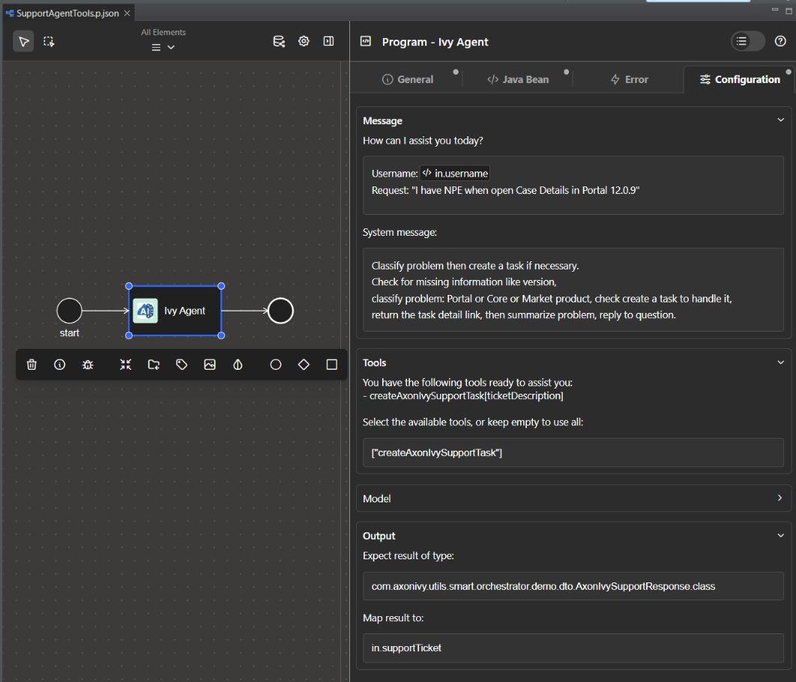
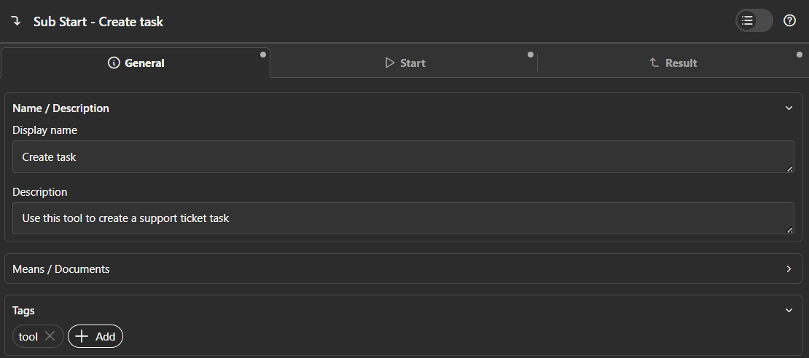
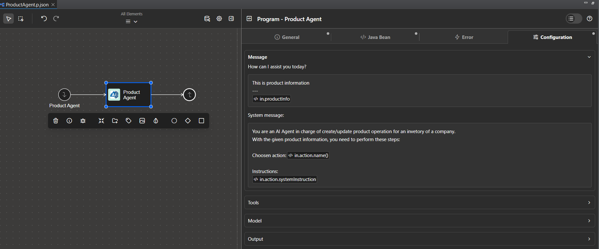
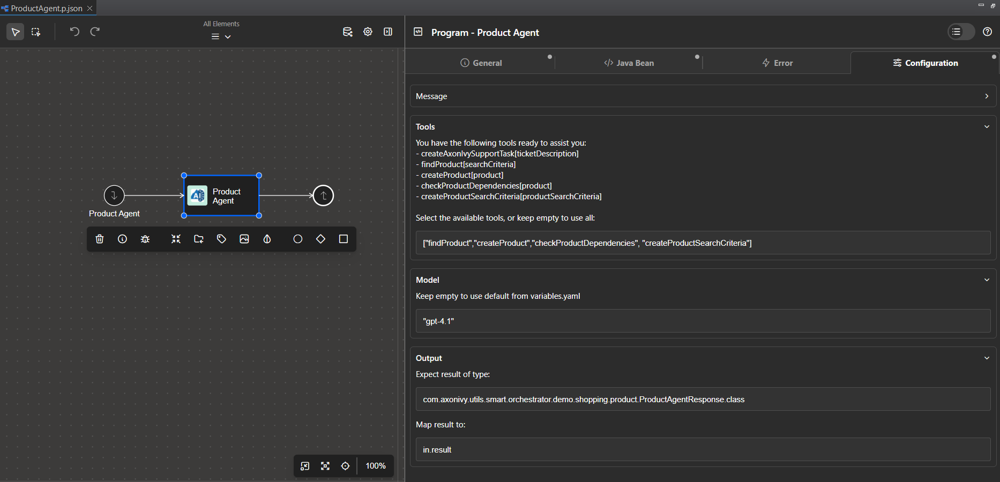

# Smart Workflow

**Smart Workflow** brings AI directly into Axon Ivy, so developers can build, run, and improve AI agents inside existing Axon processes. It lets business workflows leverage large language models to understand natural language, make autonomous decisions, and adapt to changing requirements — all without heavy architectural changes.

Key benefits of Smart Workflow:

- **Familiar setup:** Drop AI agents into BPMN processes with no structural changes and configure everything through Axon Ivy’s standard interfaces.
- **Enterprise-ready:** Built for enterprise needs with logging, monitoring, and configuration controls.
- **Flexible tools:** Turn any callable process into an AI-discoverable tool.
- **Multi-model support:** Use lightweight or advanced models depending on the task.
- **Type-safe outputs:** Produce structured Java objects from AI responses for immediate use.
- **Natural language handling:** Accept unstructured input and return human-friendly output.

**Disclaimer**

The **user is solely responsible** for the configuration, deployment, and operation of the AI and its associated agents. Any decisions, actions, or outcomes resulting from the use of this connector are entirely the responsibility of the user.

We provide only the **technical capability** to enable such configurations and expressly disclaim any liability for misuse, misconfiguration, or unintended consequences arising from its use. By using this connector, you acknowledge and accept these limitations.

## Demo

### Axon Ivy Support Agent Demo

This demo showcases how to use the Axon Ivy Support Agent, an AI-powered agent integrated into a business workflow. The agent is designed to classify support problems, check for missing information, and create support tasks automatically.

<details>
<summary><strong>Workflow Overview</strong></summary>

1. **Input:** The agent receives a support question and the username of the reporter.
2. **Classification:** It analyzes the problem, determines if information is missing (such as version), and classifies the issue (Portal, Core, or Market product).
3. **Task Creation:** If necessary, the agent creates a support task using the `createAxonIvySupportTask` tool and provides a link to the created task.
4. **Summary & Response:** The agent summarizes the problem and replies to the user with a detailed response.

</details>

<details>
<summary><strong>Technical Details</strong></summary>

- The agent is implemented as a callable sub-process (`AxonIvySupportAgent.p.json`) and uses the `com.axonivy.utils.smart.workflow.AgenticProcessCall` Java bean.
- The agent is configured to use a specific tool (`createAxonIvySupportTask`), which allows it to create support tasks automatically within the workflow. This is achieved by specifying the tool name in the agent's configuration (see example below).
- The agent's output is mapped to a structured Java object (`AxonIvySupportResponse`), making it easy to use the AI-generated result directly in Axon Ivy processes. This object typically contains details such as the classification, created task link, and a summary of the support issue.

</details>

<details>
<summary><strong>Agent Configuration Example</strong></summary>

To configure the agent, define a program element with the following settings:



This configuration ensures the agent uses only the specified tool and returns its output as a structured Java object.

</details>

<details>
<summary><strong>Demo Run Example</strong></summary>

Suppose a user submits a support question: "I have NPE when open Case Details in Portal 12.0.9"

1. The agent receives the question and username.
2. It checks for missing information (e.g., version), classifies the issue as a Portal problem, and determines that a support task should be created.
3. The agent calls the `createAxonIvySupportTask` tool, which creates a new support task and returns a link to it.
4. The agent summarizes the problem and provides a response such as:

```text
Classification: Portal
Summary: The problem is a NullPointerException (NPE) occurring when opening Case Details in Portal version 12.0.9. Since the issue is related to the Portal product and the version is provided, a support task has been created to address this problem.
```

This response is mapped to the `AxonIvySupportResponse` object and can be used directly in subsequent workflow steps.

</details>

<details>
<summary><strong>How to Run the Demo</strong></summary>

1. Ensure you have completed the [Configurations](#configurations) section.
2. Trigger the Axon Ivy Support Agent process with a support question and username.
3. Review the agent's response, which includes classification, task creation (if needed), and a summary.

</details>

---

### Shopping Demo

This demo showcases how AI can transform the operations of a small e-commerce fashion store. It’s more advanced and combines two mini-demos: one on product creation and another on semantic search. Because of its complexity, we won’t dive into the detailed code or step-by-step instructions here. If you’d like to explore the implementation, please check out the demo project `smart-workflow-demo`.

<details>
<summary><strong>Product creation</strong></summary>

Traditionally, adding a product requires the store operator to manually fill many fields and to validate or create dependent records (supplier, brand, category). For a small store this process can take hours or a full day: manual data entry, hunting for missing info, and re-checking for mistakes.

With Smart Workflow agents, the operator simply imports the product specification and image files. The agents handle parsing, validation, dependency resolution, and product creation — significantly reducing manual work and time-to-publish.

Developers need to create four agents

1. Product agent

- Input: parsed product specification
- Tools:
  - Find product: Find product in the system
  - Create product: Create a new product using the provided specification
  - Check product dependencies: Call other agents to find and validate dependencies (supplier, brand, and category)

2. Supplier agent

- Input: supplier information
- Tools:
  - Find supplier: Find supplier in the system
  - Create supplier: Create a new supplier using the provided information

3. Category agent

- Input: product category information
- Tools:
  - Find category: Find category in the system
  - Create category: Create a new category using the provided information

4. Brand agent

- Input: product brand information
- Tools:
  - Find brand: Find brand in the system
  - Create brand: Create a new brand using the provided information

Demo flow

1. Operator uploads product specification and image files.
2. Smart Workflow parses the files, extracts product attributes (title, SKU, description, price, supplier info, brand, category, images).
3. Validators check semantics and constraints (required fields, formats, SKU uniqueness, image requirements).
4. For each dependency (supplier, brand, category), Smart Workflow asks the appropriate agent:
  if the entity exists → return the ID,
  if missing → create it using the provided spec.
5. Product agent creates the product with validated attributes and links to dependency IDs.
6. System returns a summary and optionally opens a human-review screen with prefilled fields for final approval.

The new AI-powered process resulted in fewer errors, far less manual work, and a much faster time-to-publish.

</details>

<details>
<summary><strong>Semantic search</strong></summary>

Before AI, shoppers typed keyword queries like “red dress,” then manually applied filters (price, brand, category) and scanned the results. This process was not only slow and rigid but also often failed to capture synonyms, styles, or intent (e.g., party vs. work).

With semantic search the user speaks or types a natural request. AI understands intent and constraints (color, price, occasion, urgency), converts that into a structured criteria object. The backend then converts that object into SQL predicates and returns matched results. Offers clear explanations, familiar tooling, and easier deployment.

Developers need to add an additional `Find product by criteria` tool to the `Product agent` with input is the search criteria.

Demo flow

1. Shopper: types or says “I need a $100 red dress for a party tonight.”
2. `Product agent` extracts attributes and expands the query (synonyms, acceptable price range: $80–$120).
3. Axon Ivy Business Data turns criteria into an optimized filters and search for the products.
4. Return the top products matched criteria.

To quickly set up the demo data, run the process `Create data for shopping demo` from the process list.

</details>

---

### File Extraction Demo

This demo shows how to build a process that reads invoice data directly from uploaded images and PDF files — with no manual data entry. Using multimodal language models, the AI reads the document content and returns structured Java objects that subsequent process steps can use immediately.

To extract from a file, include the file content in the agent's user message. The AI reads it and maps the result to the specified Java class — no special tooling or file-system access required.

<details>
<summary><strong>Demo flow</strong></summary>

1. The process loads an invoice image and a PDF.
2. The file contents are included in the agent's user message.
3. The AI reads and extracts the invoice fields.
4. The result is returned as a typed Java object ready for the next process step.

</details>

Not all providers support multimodal input — see the [Models Contribution Guideline](../doc/MODELS.md#file-extraction-support) for supported providers and file types.

---

### Guardrail Demo

This demo shows how built-in Smart Workflow guardrails protect AI agents from prompt injection attacks and prevent sensitive data from leaking in AI responses. Without protection, a malicious user can craft a message that overrides the system prompt or tricks the agent into revealing internal data.

Two defense layers are configured in the agent's `inputGuardrails` / `outputGuardrails` fields:

- `PromptInjectionInputGuardrail` — inspects user input before it reaches the AI model and blocks known injection patterns
- `SensitiveDataOutputGuardrail` — scans the AI response before it is returned and blocks output containing API keys or private keys

Default guardrails can be set globally in `variables.yaml` under `AI.Guardrails.DefaultInput` and `AI.Guardrails.DefaultOutput` — any agent without explicit guardrails inherits these defaults.

<details>
<summary><strong>Demo flow</strong></summary>

1. A crafted malicious message is submitted. The `PromptInjectionInputGuardrail` intercepts it before the AI is called and raises an error.
2. The process catches the error via an `ErrorBoundaryEvent` and routes to a safe fallback path.
3. A second message instructs the agent to include sensitive data in its response. The `SensitiveDataOutputGuardrail` intercepts the response after the model returns and blocks it.
4. The error boundary catches this violation and routes to the safe fallback path again.

</details>

---

### Custom Guardrail Demo

This demo shows how to implement and register a domain-specific business rule as a reusable custom guardrail. A company policy requires that agents never mention competitor products. The `BlockCompetitorMentionGuardrail` enforces this rule in one place — once registered, it can be added to any agent by name without touching individual system prompts.

Developers implement `SmartWorkflowInputGuardrail`, expose it through a `GuardrailProvider`, and register the provider in `META-INF/services/com.axonivy.utils.smart.workflow.guardrails.provider.GuardrailProvider`. The guardrail name then appears automatically in the Available Input Guardrails list. Each agent opts in via `inputGuardrails: ["BlockCompetitorMentionGuardrail"]`; to apply it to every agent, add it to `AI.Guardrails.DefaultInput` in `variables.yaml`.

<details>
<summary><strong>Demo flow</strong></summary>

**Blocked query**

1. A user submits a query that mentions a competitor product.
2. `BlockCompetitorMentionGuardrail` detects the mention and blocks the request before the AI model is called.
3. The process catches the error and routes to a safe fallback path.

**Allowed query**

1. A user submits a query with no competitor mentions.
2. `BlockCompetitorMentionGuardrail` finds nothing to block and allows the request through.
3. The agent processes the query and responds normally.

</details>

---

## Patterns

The demos below illustrate **best practices** for structuring Axon Ivy agents and tools with Smart Workflow. Two complementary patterns are shown: one for tightly scoping an agent's tool access, and one for gaining full task-level observability over multi-step AI pipelines.

### Invoice Analyzer — Agent + Tools in One Callable

This pattern shows how to bundle an agent together with all of its tools inside a single callable subprocess. Everything the agent is permitted to call is defined in one file, creating a clear boundary around the feature that is easy to audit, test, and replace.

The orchestrating agent and all its tools are co-located in the same process file. The agent's tool access is explicitly restricted to only the tools defined within that file — no other tools are reachable. This makes the agent's full capability visible at a glance and prevents unintended tool access.

<details>
<summary><strong>Demo flow</strong></summary>

1. Raw invoice text is passed to the callable entry point.
2. The Invoice Analyzer Agent invokes its tools in sequence: extract header info → extract line items → validate amounts → assess compliance.
3. Each tool runs its own focused AI agent and returns a typed result.
4. The orchestrating agent compiles all findings into a structured analysis report and returns it to the caller.

</details>

---

### Feature-Grouped Agents and Tools

This pattern shows how to organize agents and tools by business domain when tools need to be shared across multiple agents. Rather than bundling everything inside a single callable, each agent and each tool group lives in its own process file under a common feature folder — making the domain boundary explicit and allowing tool reuse.

```
processes/
  Shopping/
    agents/
      ProductAgent.p.json
      BrandAgent.p.json
      SupplierAgent.p.json
      CategoryAgent.p.json
    tools/
      ProductTools.p.json
      BrandTools.p.json
      SupplierTools.p.json
      CategoryTools.p.json
```

---

### Multi-Task Processes — Task-Per-Stage

This pattern shows how wrapping each AI agent invocation in a dedicated Axon Ivy **task** gives every AI step its own lifecycle — enabling filtering, audit logging, and retry at the task level without changing the agent logic.

Two independent flows are included to illustrate the pattern at different scales.

**AI Order Processing (`multiTaskDemo`)**

<details>
<summary><strong>Demo flow</strong></summary>

1. Task 1 – `Product Extraction Agent` and `Pricing Agent` run sequentially to process the raw purchase order.
2. Task 2 – `Invoice Generator Agent` combines the extracted products and pricing into a structured invoice object.
3. Task 3 – `Quality Review Agent` and `Confirmation Agent` run sequentially to produce a quality report and a customer confirmation draft.

</details>

**AI Product Import (`productImportDemo`)**

<details>
<summary><strong>Demo flow</strong></summary>

1. Task 1 – `CSV Parser Agent` and `Data Validator Agent` parse and validate the import file sequentially.
2. Task 2 – `Category Mapper Agent` and `Brand Resolver Agent` resolve product metadata sequentially.
3. Task 3 – `Product Enrichment Agent` combines all metadata into enriched product data.
4. Task 4 – `Import Report Agent` generates the final import summary.

</details>

---

## Setup

To start your AI initiative, we need to define the Models and Tools in advance.

### Models

Smart Workflow isn't bound to a specific AI vendor. 
You can select your preferred model providers at installation time.

After installation, please choose your default model provider

The selection of your provider is done with the variable `AI.DefaultProvider`. 
Furthermore, most model providers need an ApiKey or another unique identifier.
Check your provider below, to see which variables need to be set in addition.

To request support for additional AI model providers, please open an issue or submit a pull request on GitHub.
When contributing, make sure to follow the [Models Contribution Guideline](../doc/MODELS.md) to keep your provider aligned with the Smart Workflow ecosystem.

```yaml
@variables.yaml@
```

#### OpenAI Models

<details>

<summary>OpenAI setup instructions</summary>
OpenAI models are natively supported. If you wish to use them import the `smart-workflow-openai` project and define your OpenAI key.

```yaml
@variables.openai@
```
</details>

#### Azure OpenAI Models

<details>

<summary>Azure OpenAI setup instructions</summary>
Azure OpenAI models are supported. To use Azure OpenAI, import the `smart-workflow-azure-openai` project and configure your Azure OpenAI endpoint and deployments.

Each deployment in Azure OpenAI represents a model instance with its own API key. You can configure multiple deployments to use different models for different tasks.

```yaml
@variables.azureopenai@
```

Example Configuration:

```yaml
@variables.azureopenai.example@
```
</details>

#### Google Gemini Models

<details>

<summary>Google Gemini setup instructions</summary>
Google Gemini models are supported. To use Google Gemini, import the `smart-workflow-gemini` project and configure your Gemini API key and default model.
This provider does not support the structured output feature because Google Gemini models do not support structured JSON responses.

```yaml
@variables.gemini@
```

Example Configuration:

```yaml
@variables.gemini.example@
```
</details>

#### x.AI Models

<details>

<summary>x.AI setup instructions</summary>
x.AI models are supported, import the `smart-workflow-xai` to work with these.

```yaml
@variables.xai@
```

Example Configuration:

```yaml
@variables.xai.example@
```

</details>

#### Anthropic Models

<details>

<summary>Anthropic setup instructions</summary>
Claude models (including Claude Opus, Sonnet and Haiku) from Anthropic are supported. Import the `smart-workflow-anthropic` project, configure your API key to get started.

> **Note:** Structured outputs are only supported on Claude Opus 4.6, Claude Sonnet 4.6, Claude Sonnet 4.5, Claude Opus 4.5, and Claude Haiku 4.5. Older models (e.g., Claude Sonnet 4, Claude Opus 4) do not support this feature.

```yaml
@variables.anthropic@
```

Example Configuration:

```yaml
@variables.anthropic.example@
```

</details>

### File Extraction

Axon Ivy Smart Workflow supports extracting content from PDF and image files (PNG, JPG, and JPEG) using multimodal LLMs.
This allows AI agents to read and reason over uploaded documents and images directly within your workflows.

Not all providers and models support multimodal input.
Refer to the [Models Contribution Guideline](../doc/MODELS.md#file-extraction-support) for the full list of supported providers and file types.

### Guardrails

Guardrails protect AI agents by validating user input before it reaches the model and by checking model outputs before they are used. Smart Workflow includes the following built-in guardrails:

| Guardrail | Type | Description |
|-----------|------|-------------|
| `PromptInjectionInputGuardrail` | Input | Blocks common prompt injection attacks |
| `SensitiveDataOutputGuardrail` | Output | Blocks responses containing API keys or private keys |

#### Configuring Default Guardrails

Set default guardrails in `variables.yaml`:

```yaml
Variables:
  AI:
    Guardrails:
      # Comma-separated list of guardrail names
      DefaultInput: PromptInjectionInputGuardrail
      DefaultOutput: SensitiveDataOutputGuardrail
```

#### Using Guardrails in Agents

In the agent configuration, specify guardrails as a String array:

```java
// Input guardrails
["PromptInjectionInputGuardrail", "MyCustomInputGuardrail"]

// Output guardrails
["SensitiveDataOutputGuardrail", "MyCustomOutputGuardrail"]
```

If no guardrails are specified, the agent uses the default guardrails from `variables.yaml`.

Smart Workflow also lets you implement custom guardrails and handle guardrail errors. For more details, see the [Guardrails Guideline](../doc/GUARDRAILS.md).

### Defining Tools with Callable Processes

To function effectively, AI agents require tools to perform tasks. With Smart Workflow, creating a tool is straightforward: simply define a callable process and add the `tool` tag to it.

To select the appropriate tool, AI agents rely on the descriptions of callable processes. To ensure efficient tool selection, clearly describe the tool's purpose in the `description` field.



### Defining AI agent

To define an AI agent, create a program element backed by the `com.axonivy.utils.smart.workflow.AgenticProcessCall` Java bean. In the `Configuration` tab, you can access and customize detailed settings for your AI agent.

#### Message

In the `Message` section, you can specify the user message and system message for the agent. By allowing code injection directly into these fields, Smart Workflow offers a convenient way for developers to define messages before they are sent to the AI service.



#### Tools

Below the `Messages` section is the `Tools` section, where you can define the set of tools the agent should use as a String array. For example:

```java
["findProduct","createProduct","checkProductDependencies", "createProductSearchCriteria"]
```

By default, if no tools are specified, Smart Workflow assumes the agent can use all available tools. Therefore, it is recommended to define a specific set of tools for each agent to improve response speed and prevent the use of inappropriate tools.

#### Model

Not all AI agents are created equal. 
In Axon Ivy, we recognize that AI agents handle tasks of varying complexity. 
Some agents perform simple tasks, such as creating leave requests or gathering user information, 
while others must search databases for products and evaluate dependencies like suppliers and brands. 
Therefore, Smart Workflow allows developers to select the underlying AI model based on the use case.

To do this, simply enter the desired AI model in the `Model` section. 
By default, if no model is specified, Smart Workflow uses the model defined in the variable `AI.OpenAI.Model`.

#### Output

For enterprise-level AI applications, it is common to require the AI agent’s result in the form of a usable object.
To address this need, the Smart Workflow AI agent can produce output as a Java object, ready to be used directly by Axon Ivy processes.

You can easily configure this by specifying both the expected result type and the target object to map the result to in the `Output` section.


