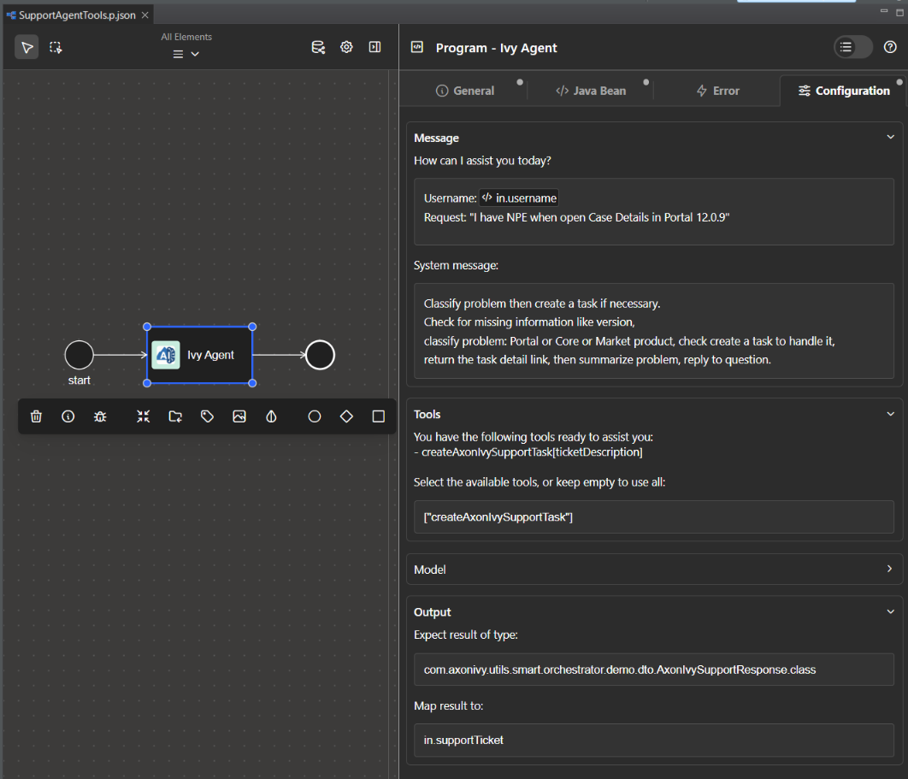

# Smart Workflow

*[Deutsche Version](README_DE.md)*

**Smart Workflow** brings AI directly into Axon Ivy, so developers can build, run, and improve AI agents inside existing Axon processes. It lets business workflows leverage large language models to understand natural language, make autonomous decisions, and adapt to changing requirements — all without heavy architectural changes.

Key benefits of Smart Workflow:

- **Familiar setup:** Drop AI agents into BPMN processes with no structural changes and configure everything through Axon Ivy’s standard interfaces.
- **Enterprise-ready:** Built for enterprise needs with logging, monitoring, and configuration controls.
- **Flexible tools:** Turn any callable process into an AI-discoverable tool.
- **Multi-model support:** Use lightweight or advanced models depending on the task.
- **Type-safe outputs:** Produce structured Java objects from AI responses for immediate use.
- **Natural language handling:** Accept unstructured input and return human-friendly output.

**Disclaimer**

The **user is solely responsible** for the configuration, deployment, and operation of the AI and its associated agents. Any decisions, actions, or outcomes resulting from the use of this connector are entirely the responsibility of the user.

We provide only the **technical capability** to enable such configurations and expressly disclaim any liability for misuse, misconfiguration, or unintended consequences arising from its use. By using this connector, you acknowledge and accept these limitations.

## Features

| Feature | What it gives you |
| --- | --- |
| [AI agent element](https://github.com/axonivy-market/smart-workflow/blob/master/doc/user/build/agent-setup.md) | `AgenticProcessCall` — an agent as a process step, returning text or a typed Java object |
| [Model providers](https://github.com/axonivy-market/smart-workflow/blob/master/doc/user/build/providers.md) | Hosted APIs, an enterprise platform, or a model on your own hardware — chosen globally or per agent |
| [Tools](https://github.com/axonivy-market/smart-workflow/blob/master/doc/user/build/tools.md) | Any callable sub-process becomes a tool the agent can invoke, plus Java tools and a built-in `webSearch` |
| [File extraction](https://github.com/axonivy-market/smart-workflow/blob/master/doc/user/build/file-extraction.md) | Read invoices, forms and scans directly from PDF and image files |
| [RAG](https://github.com/axonivy-market/smart-workflow/blob/master/doc/user/build/rag.md) | Ground answers in your own documents with OpenSearch vector search |
| [Human in the loop](https://github.com/axonivy-market/smart-workflow/blob/master/doc/user/build/human-in-the-loop.md) | Suspend an agent mid-run for a human decision as an Ivy task, then resume it |
| [Guardrails](https://github.com/axonivy-market/smart-workflow/blob/master/doc/user/operate/guardrails.md) | Prompt-injection defence, credential-leak blocking, and PII masking for GDPR-sensitive data |
| [Circuit breaker](https://github.com/axonivy-market/smart-workflow/blob/master/doc/user/operate/circuit-breaker.md) | One switch that stops every AI call in the application |
| [Observability](https://github.com/axonivy-market/smart-workflow/blob/master/doc/user/operate/observability.md) | Arize Phoenix tracing, Ivy conversation history for audit, and AI-usage custom fields |

📘 **[Full documentation](https://github.com/axonivy-market/smart-workflow/blob/master/README.md)** · 🚀 **[Getting Started](https://github.com/axonivy-market/smart-workflow/blob/master/doc/user/getting-started.md)**

## Demo

### Axon Ivy Support Agent Demo

This demo showcases how to use the Axon Ivy Support Agent, an AI-powered agent integrated into a business workflow. The agent is designed to classify support problems, check for missing information, and create support tasks automatically.

<details>
<summary><strong>Workflow Overview</strong></summary>

1. **Input:** The agent receives a support question and the username of the reporter.
2. **Classification:** It analyzes the problem, determines if information is missing (such as version), and classifies the issue (Portal, Core, or Market product).
3. **Task Creation:** If necessary, the agent creates a support task using the `createAxonIvySupportTask` tool and provides a link to the created task.
4. **Summary & Response:** The agent summarizes the problem and replies to the user with a detailed response.

</details>

<details>
<summary><strong>Technical Details</strong></summary>

- The agent is implemented as a callable sub-process (`AxonIvySupportAgent.p.json`) and uses the `com.axonivy.utils.smart.workflow.AgenticProcessCall` Java bean.
- The agent is configured to use a specific tool (`createAxonIvySupportTask`), which allows it to create support tasks automatically within the workflow. This is achieved by specifying the tool name in the agent's configuration (see example below).
- The agent's output is mapped to a structured Java object (`AxonIvySupportResponse`), making it easy to use the AI-generated result directly in Axon Ivy processes. This object typically contains details such as the classification, created task link, and a summary of the support issue.

</details>

<details>
<summary><strong>Agent Configuration Example</strong></summary>

To configure the agent, define a program element with the following settings:



This configuration ensures the agent uses only the specified tool and returns its output as a structured Java object.

</details>

<details>
<summary><strong>Demo Run Example</strong></summary>

Suppose a user submits a support question: "I have NPE when open Case Details in Portal 12.0.9"

1. The agent receives the question and username.
2. It checks for missing information (e.g., version), classifies the issue as a Portal problem, and determines that a support task should be created.
3. The agent calls the `createAxonIvySupportTask` tool, which creates a new support task and returns a link to it.
4. The agent summarizes the problem and provides a response such as:

```text
Classification: Portal
Summary: The problem is a NullPointerException (NPE) occurring when opening Case Details in Portal version 12.0.9. Since the issue is related to the Portal product and the version is provided, a support task has been created to address this problem.
```

This response is mapped to the `AxonIvySupportResponse` object and can be used directly in subsequent workflow steps.

</details>

<details>
<summary><strong>How to Run the Demo</strong></summary>

1. Ensure you have completed the [Setup](#setup) section.
2. Start **Axon Ivy Support** process with a support question and username.
3. Review the agent's response, which includes classification, task creation (if needed), and a summary.

</details>

---

### Shopping Demo

This demo showcases how AI can transform the operations of a small e-commerce fashion store. It’s more advanced and combines two mini-demos: one on product creation and another on semantic search. Because of its complexity, we won’t dive into the detailed code or step-by-step instructions here. If you’d like to explore the implementation, please check out the demo project `smart-workflow-demo`.

<details>
<summary><strong>Product creation</strong></summary>

Traditionally, adding a product requires the store operator to manually fill many fields and to validate or create dependent records (supplier, brand, category). For a small store this process can take hours or a full day: manual data entry, hunting for missing info, and re-checking for mistakes.

With Smart Workflow agents, the operator simply imports the product specification and image files. The agents handle parsing, validation, dependency resolution, and product creation — significantly reducing manual work and time-to-publish.

Developers need to create four agents

1. Product agent

- Input: parsed product specification
- Tools:
  - Find product: Find product in the system
  - Create product: Create a new product using the provided specification
  - Check product dependencies: Call other agents to find and validate dependencies (supplier, brand, and category)

2. Supplier agent

- Input: supplier information
- Tools:
  - Find supplier: Find supplier in the system
  - Create supplier: Create a new supplier using the provided information

3. Category agent

- Input: product category information
- Tools:
  - Find category: Find category in the system
  - Create category: Create a new category using the provided information

4. Brand agent

- Input: product brand information
- Tools:
  - Find brand: Find brand in the system
  - Create brand: Create a new brand using the provided information

Demo flow (start **Create new product** process)

1. Operator uploads product specification and image files.
2. Smart Workflow parses the files, extracts product attributes (title, SKU, description, price, supplier info, brand, category, images).
3. Validators check semantics and constraints (required fields, formats, SKU uniqueness, image requirements).
4. For each dependency (supplier, brand, category), Smart Workflow asks the appropriate agent:
  if the entity exists → return the ID,
  if missing → create it using the provided spec.
5. Product agent creates the product with validated attributes and links to dependency IDs.
6. System returns a summary and optionally opens a human-review screen with prefilled fields for final approval.

The new AI-powered process resulted in fewer errors, far less manual work, and a much faster time-to-publish.

</details>

<details>
<summary><strong>Semantic search</strong></summary>

Before AI, shoppers typed keyword queries like “red dress,” then manually applied filters (price, brand, category) and scanned the results. This process was not only slow and rigid but also often failed to capture synonyms, styles, or intent (e.g., party vs. work).

With semantic search the user speaks or types a natural request. AI understands intent and constraints (color, price, occasion, urgency), converts that into a structured criteria object. The backend then converts that object into SQL predicates and returns matched results. Offers clear explanations, familiar tooling, and easier deployment.

Developers need to add an additional `Find product by criteria` tool to the `Product agent` with input is the search criteria.

Demo flow (start **Shopping Store** process)

1. Shopper: types or says “I need a $100 red dress for a party tonight.”
2. `Product agent` extracts attributes and expands the query (synonyms, acceptable price range: $80–$120).
3. Axon Ivy Business Data turns criteria into an optimized filters and search for the products.
4. Return the top products matched criteria.

To quickly set up the demo data, start **Create data for shopping demo** from the process list.

</details>

---

### File Extraction Demo

This demo shows how to build a process that reads invoice data directly from uploaded images and PDF files — with no manual data entry. Using multimodal language models, the AI reads the document content and returns structured Java objects that subsequent process steps can use immediately.

To extract from a file, include the file content in the agent's user message. The AI reads it and maps the result to the specified Java class — no special tooling or file-system access required.

<details>
<summary><strong>Demo flow</strong></summary>

- Start **File Extraction Demo (CMS)** or **File Extraction Demo (Binary)** from the process list.

  1. The process loads an invoice image and a PDF.
  2. The file contents are included in the agent's user message.
  3. The AI reads and extracts the invoice fields.
  4. The result is returned as a typed Java object ready for the next process step.

</details>

Not all providers support multimodal input — see [Provider Capabilities](https://github.com/axonivy-market/smart-workflow/blob/master/doc/user/reference/capabilities.md#file-extraction) for supported providers and file types.

---

### Guardrail Demo

This demo shows how built-in Smart Workflow guardrails protect AI agents from prompt injection attacks and prevent sensitive data from leaking in AI responses. Without protection, a malicious user can craft a message that overrides the system prompt or tricks the agent into revealing internal data.

Two defence layers are configured in the agent's guardrail pickers:

- `PromptInjectionInputGuardrail` — inspects user input before it reaches the AI model and blocks known injection patterns
- `SensitiveDataOutputGuardrail` — scans the AI response before it is returned and blocks output containing API keys or private keys

Default guardrails can be set globally in the Engine Cockpit, under `AI.Guardrails.DefaultInput` and `AI.Guardrails.DefaultOutput` — any agent without explicit guardrails inherits these defaults.

<details>
<summary><strong>Demo flow</strong></summary>

- **Prompt injection** (start **Prompt Injection Guardrail Demo** process)

  1. A crafted malicious message is submitted. The `PromptInjectionInputGuardrail` intercepts it before the AI is called and raises an error.
  2. The process catches the error via an `ErrorBoundaryEvent` and routes to a safe fallback path.

- **Sensitive data output** (start **Sensitive Data Output Guardrail Demo** process)

  1. A message instructs the agent to include sensitive data in its response. The `SensitiveDataOutputGuardrail` intercepts the response after the model returns and blocks it.
  2. The error boundary catches this violation and routes to the safe fallback path again.

</details>

---

### Custom Guardrail Demo

This demo shows how to implement and register a domain-specific business rule as a reusable custom guardrail. A company policy requires that agents never mention competitor products. The `BlockCompetitorMentionGuardrail` enforces this rule in one place — once registered, it can be added to any agent by name without touching individual system prompts.

Developers implement `SmartWorkflowInputGuardrail`, expose it through a `GuardrailProvider`, and register the provider via SPI. The guardrail name then appears automatically in the agent's `Input guardrails:` picker. To apply it to every agent, add it to `AI.Guardrails.DefaultInput` in the Engine Cockpit.

<details>
<summary><strong>Demo flow</strong></summary>

- **Blocked query** (start **Custom Guardrail Demo - Blocked** process)

  1. A user submits a query that mentions a competitor product.
  2. `BlockCompetitorMentionGuardrail` detects the mention and blocks the request before the AI model is called.
  3. The process catches the error and routes to a safe fallback path.

- **Allowed query** (start **Custom Guardrail Demo - Allowed** process)

  1. A user submits a query with no competitor mentions.
  2. `BlockCompetitorMentionGuardrail` finds nothing to block and allows the request through.
  3. The agent processes the query and responds normally.

</details>

See [Custom Guardrails](https://github.com/axonivy-market/smart-workflow/blob/master/doc/user/contribute/guardrails-spi.md) for the step-by-step guide.

---

### Agent Patterns

The demo project also illustrates three ways to structure agents and tools in a larger application: a linear **Agent Pipeline**, a **Self-Contained Agent** with co-located tools, and **Feature-Grouped** agents that share tools across a business domain.

See [Agent Patterns](https://github.com/axonivy-market/smart-workflow/blob/master/doc/user/build/patterns.md).

## Setup

To start your AI initiative, define the Models and Tools in advance. For a step-by-step walkthrough from installation to a working agent, follow [Getting Started](https://github.com/axonivy-market/smart-workflow/blob/master/doc/user/getting-started.md).

### Models

Smart Workflow isn't bound to a specific AI vendor.
You can select your preferred model providers at installation time.

After installation, please choose your default model provider.

The selection of your provider is done with the variable `AI.DefaultProvider`, set in the Engine Cockpit under **Variables**.
Furthermore, most model providers need an ApiKey or another unique identifier.
Check your provider below, to see which variables need to be set in addition.

To request support for additional AI model providers, please open an issue or submit a pull request on GitHub.
When contributing, make sure to follow the [Models Contribution Guideline](https://github.com/axonivy-market/smart-workflow/blob/master/doc/user/contribute/models.md) to keep your provider aligned with the Smart Workflow ecosystem.

```yaml
@variables.yaml@
```

#### OpenAI Models

<details>

<summary>OpenAI setup instructions</summary>
OpenAI models are natively supported. If you wish to use them import the `smart-workflow-openai` project and define your OpenAI key.

```yaml
@variables.openai@
```
</details>

#### Azure OpenAI Models

<details>

<summary>Azure OpenAI setup instructions</summary>
Azure OpenAI models are supported. To use Azure OpenAI, import the `smart-workflow-azure-openai` project and configure your Azure OpenAI endpoint and deployments.

Each deployment in Azure OpenAI represents a model instance with its own API key. You can configure multiple deployments to use different models for different tasks.

```yaml
@variables.azureopenai@
```

Example Configuration:

```yaml
@variables.azureopenai.example@
```
</details>

#### Google Gemini Models

<details>

<summary>Google Gemini setup instructions</summary>
Google Gemini models are supported. To use Google Gemini, import the `smart-workflow-gemini` project and configure your Gemini API key and default model.
This provider does not support the structured output feature because Google Gemini models do not support structured JSON responses.

```yaml
@variables.gemini@
```

Example Configuration:

```yaml
@variables.gemini.example@
```
</details>

#### x.AI Models

<details>

<summary>x.AI setup instructions</summary>
x.AI models are supported, import the `smart-workflow-xai` to work with these.

```yaml
@variables.xai@
```

Example Configuration:

```yaml
@variables.xai.example@
```

</details>

#### Anthropic Models

<details>

<summary>Anthropic setup instructions</summary>
Claude models (including Claude Opus, Sonnet and Haiku) from Anthropic are supported. Import the `smart-workflow-anthropic` project, configure your API key to get started.

> **Note:** Structured output is enabled for every Claude model Smart Workflow lists — there is no version gate. Newer models (Claude Opus 4.6, Sonnet 4.6, Opus 4.5, Sonnet 4.5, Haiku 4.5) are more reliable at producing schema-valid output than the 4.0 generation.

```yaml
@variables.anthropic@
```

Example Configuration:

```yaml
@variables.anthropic.example@
```

</details>

#### Ollama Models

<details>

<summary>Ollama setup instructions</summary>
Ollama lets you run open-source models (Llama, Gemma, Qwen, Mistral, ...) locally or on your own infrastructure. Import the `smart-workflow-ollama` project, install [Ollama](https://ollama.com/), and pull the model you want to use (e.g. `ollama pull llama3.2`).

Configure the `BaseUrl` of your Ollama server (defaults to `http://localhost:11434`) and the `DefaultModel`. No API key is required.

> **Note:** On Ollama, structured output and tools are mutually exclusive — when an agent has both, the schema is dropped silently. Structured output also depends on the underlying model: recent models (Llama 3.1+, Gemma 3, Qwen 3, Mistral Nemo, ...) handle JSON-schema-constrained responses on Ollama 0.3.0+, while older or smaller models may return free-form text.

> **Note on embeddings:** Pull a dedicated embedding model such as `nomic-embed-text` or `mxbai-embed-large` and set it as `DefaultEmbeddingModel` to use the RAG features with Ollama.

```yaml
@variables.ollama@
```

Example Configuration:

```yaml
@variables.ollama.example@
```

</details>

### Defining an AI agent

Create a program element backed by the `com.axonivy.utils.smart.workflow.AgenticProcessCall` Java bean. Its `Configuration` tab has five groups: **Message** for the system and user messages, **Tools** for what the agent may call, **Guardrails** for input and output validation, **Model** for the provider and model, and **Output** for the result type and where it is written.

Two behaviours surprise people, and they are opposites: an empty `Available tools:` field grants the agent **no** tools, while empty guardrail fields **inherit** the application defaults.

For the complete field reference — including structured output, screenshots of each group, and the failure modes worth knowing about — see [Agent Setup](https://github.com/axonivy-market/smart-workflow/blob/master/doc/user/build/agent-setup.md).

### Defining tools

AI agents require tools to perform tasks. Smart Workflow supports two kinds: **Callable Process Tools** (any callable sub-process tagged `tool`) and **Java Tools** (implement `SmartWorkflowTool` and register via SPI). Callable processes are the recommended route — they give the agent full access to the process designer.

For step-by-step instructions on creating both tool types, see [Defining Tools](https://github.com/axonivy-market/smart-workflow/blob/master/doc/user/build/tools.md).

### Guardrails

Guardrails validate user input before it reaches the model and check model output before it is used. Four are built in:

| Guardrail | Type | Description |
| --- | --- | --- |
| `PromptInjectionInputGuardrail` | Input | Blocks common prompt injection attacks using regex patterns. No LLM cost. |
| `AiPromptInjectionInputGuardrail` | Input | LLM classifier that also catches roleplay jailbreaks, authority spoofing and narrative payloads. |
| `SensitiveDataOutputGuardrail` | Output | Blocks responses that leak credentials. |
| `PiiMaskingGuardrail` | Input **and** Output | Masks personal data before it reaches the model and restores it in the response. For GDPR and similar regimes. |

Select them per agent in the element's guardrail pickers, or set application-wide defaults in the Engine Cockpit:

```yaml
Variables:
  AI:
    Guardrails:
      # Comma-separated list of guardrail names
      DefaultInput: PromptInjectionInputGuardrail
      DefaultOutput: SensitiveDataOutputGuardrail
```

An agent that specifies no guardrails inherits these defaults. Smart Workflow also lets you implement custom guardrails and handle guardrail errors — see [Guardrails](https://github.com/axonivy-market/smart-workflow/blob/master/doc/user/operate/guardrails.md).

### File extraction

Smart Workflow supports extracting content from PDF and image files (PNG, JPG, JPEG) using multimodal LLMs, so agents can read and reason over uploaded documents directly within your workflows. Reference the file in the agent's user message and the result maps to a typed Java class.

Not all providers and models support multimodal input — see [Provider Capabilities](https://github.com/axonivy-market/smart-workflow/blob/master/doc/user/reference/capabilities.md#file-extraction) and [File Extraction](https://github.com/axonivy-market/smart-workflow/blob/master/doc/user/build/file-extraction.md).
