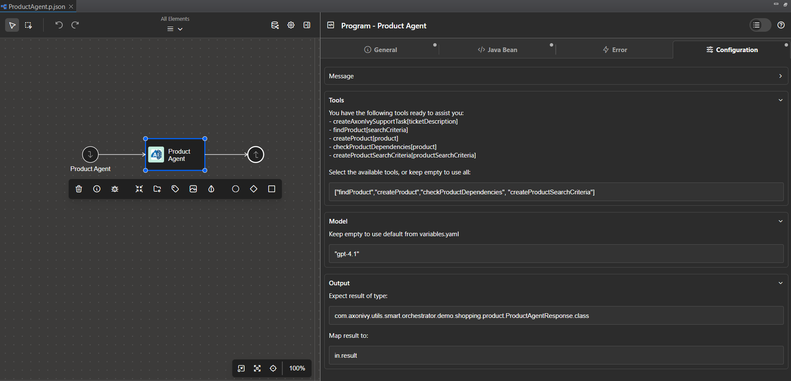

# Smart Workflow

**Smart Workflow** brings AI directly into Axon Ivy, so developers can build, run, and improve AI agents inside existing Axon processes. It lets business workflows leverage large language models to understand natural language, make autonomous decisions, and adapt to changing requirements — all without heavy architectural changes.

Key benefits of Smart Workflow:

- **Familiar setup:** Drop AI agents into BPMN processes with no structural changes and configure everything through Axon Ivy’s standard interfaces.

- **Enterprise-ready:** Built for enterprise needs with logging, monitoring, and configuration controls.

- **Flexible tools:** Turn any callable process into an AI-discoverable tool.

- **Multi-model support:** Use lightweight or advanced models depending on the task.

- **Type-safe outputs:** Produce structured Java objects from AI responses for immediate use.

- **Natural language handling:** Accept unstructured input and return human-friendly output.

**Disclaimer**

This connector is provided as an **Alpha version** and is intended for testing and evaluation purposes only. It may contain errors, incomplete features, or other issues that could affect stability, performance, or functionality. Use of this connector is at your own risk.

The **user is solely responsible** for the configuration, deployment, and operation of the AI and its associated agents. Any decisions, actions, or outcomes resulting from the use of this connector are entirely the responsibility of the user.

We provide only the **technical capability** to enable such configurations and expressly disclaim any liability for misuse, misconfiguration, or unintended consequences arising from its use. By using this connector, you acknowledge and accept these limitations.

## Demo

### Axon Ivy Support Agent Demo

This demo showcases how to use the Axon Ivy Support Agent, an AI-powered agent integrated into a business workflow. The agent is designed to classify support problems, check for missing information, and create support tasks automatically.

**Workflow Overview:**

1. **Input:** The agent receives a support question and the username of the reporter.
2. **Classification:** It analyzes the problem, determines if information is missing (such as version), and classifies the issue (Portal, Core, or Market product).
3. **Task Creation:** If necessary, the agent creates a support task using the `createAxonIvySupportTask` tool and provides a link to the created task.
4. **Summary & Response:** The agent summarizes the problem and replies to the user with a detailed response.

**Technical Details:**

- The agent is implemented as a callable sub-process (`AxonIvySupportAgent.p.json`) and uses the `com.axonivy.utils.smart.workflow.AgenticProcessCall` Java bean.
- The agent is configured to use a specific tool (`createAxonIvySupportTask`), which allows it to create support tasks automatically within the workflow. This is achieved by specifying the tool name in the agent's configuration (see example below).
- The agent's output is mapped to a structured Java object (`AxonIvySupportResponse`), making it easy to use the AI-generated result directly in Axon Ivy processes. This object typically contains details such as the classification, created task link, and a summary of the support issue.

**Agent Configuration Example:**

To configure the agent, define a program element with the following settings:


This configuration ensures the agent uses only the specified tool and returns its output as a structured Java object.

**Demo Run Example:**

Suppose a user submits a support question: "I have NPE when open Case Details in Portal 12.0.9"

1. The agent receives the question and username.
2. It checks for missing information (e.g., version), classifies the issue as a Portal problem, and determines that a support task should be created.
3. The agent calls the `createAxonIvySupportTask` tool, which creates a new support task and returns a link to it.
4. The agent summarizes the problem and provides a response such as:

```text
Classification: Portal
Summary: The problem is a NullPointerException (NPE) occurring when opening Case Details in Portal version 12.0.9. Since the issue is related to the Portal product and the version is provided, a support task has been created to address this problem.
```

This response is mapped to the `AxonIvySupportResponse` object and can be used directly in subsequent workflow steps.

How to Run the Demo:

1. Ensure you have completed the [Configurations](#configurations) section.
2. Trigger the Axon Ivy Support Agent process with a support question and username.
3. Review the agent's response, which includes classification, task creation (if needed), and a summary.

### Shopping Demo

This demo showcases how AI can transform the operations of a small e-commerce fashion store. It’s more advanced and combines two mini-demos: one on product creation and another on semantic search. Because of its complexity, we won’t dive into the detailed code or step-by-step instructions here. If you’d like to explore the implementation, please check out the demo project `smart-workflow-demo`.

**Product creation**

Traditionally, adding a product requires the store operator to manually fill many fields and to validate or create dependent records (supplier, brand, category). For a small store this process can take hours or a full day: manual data entry, hunting for missing info, and re-checking for mistakes.

With Smart Workflow agents, the operator simply imports the product specification and image files. The agents handle parsing, validation, dependency resolution, and product creation — significantly reducing manual work and time-to-publish.

Developers need to create four agents

1. Product agent

- Input: parsed product specification
- Tools:
  - Find product: Find product in the system
  - Create product: Create a new product using the provided specification
  - Check product dependencies: Call other agents to find and validate dependencies (supplier, brand, and category)

2. Supplier agent

- Input: supplier information
- Tools:
  - Find supplier: Find supplier in the system
  - Create supplier: Create a new supplier using the provided information

3. Category agent

- Input: product category information
- Tools:
  - Find category: Find category in the system
  - Create category: Create a new category using the provided information

4. Brand agent

- Input: product brand information
- Tools:
  - Find brand: Find brand in the system
  - Create brand: Create a new brand using the provided information

Demo flow

1. Operator uploads product specification and image files.
2. Smart Workflow parses the files, extracts product attributes (title, SKU, description, price, supplier info, brand, category, images).
3. Validators check semantics and constraints (required fields, formats, SKU uniqueness, image requirements).
4. For each dependency (supplier, brand, category), Smart Workflow asks the appropriate agent:
  if the entity exists → return the ID,
  if missing → create it using the provided spec.
5. Product agent creates the product with validated attributes and links to dependency IDs.
6. System returns a summary and optionally opens a human-review screen with prefilled fields for final approval.

The new AI-powered process resulted in fewer errors, far less manual work, and a much faster time-to-publish.

**Semantic search**

Before AI, shoppers typed keyword queries like “red dress,” then manually applied filters (price, brand, category) and scanned the results. This process was not only slow and rigid but also often failed to capture synonyms, styles, or intent (e.g., party vs. work).

With semantic search the user speaks or types a natural request. AI understands intent and constraints (color, price, occasion, urgency), converts that into a structured criteria object. The backend then converts that object into SQL predicates and returns matched results. Offers explainability, familiar tooling, and easier deployment.

Developers need to add an additional `Find product by criteria` tool to the `Product agent` with input is the search criteria.

Demo flow

1. Shopper: types or says “I need a $100 red dress for a party tonight.”
2. `Product agent` extracts attributes and expands the query (synonyms, acceptable price range: $80–$120).
3. Axon Ivy Business Data turns criteria into an optimized filters and search for the products.
4. Return the top products matched criteria.

To quickly set up the demo data, run the process `Create data for shopping demo` from the process list.

## Setup

### Configurations

Before start working with Smart Workflow, you need to provide some configurations using Axon Ivy variables:

- `AI.OpenAI.APIKey`: API key of your OpenAI account.
- `AI.OpenAI.Model`: Default OpenAI model. Currently we are supporting `gpt-4o`, `gpt-4.1`, `gpt-4.1-mini`, `gpt-4.1-nano`, and `gpt-5` models.

### Defining Tools with Callable Processes

To function effectively, AI agents require tools to perform tasks. With Smart Workflow, creating a tool is straightforward: simply define a callable process and add the `tool` tag to it.

To select the appropriate tool, AI agents rely on the descriptions of callable processes. To ensure efficient tool selection, clearly describe the tool's purpose in the `description` field.


### Defining AI agent

To define an AI agent, create a program element backed by the `com.axonivy.utils.smart.workflow.AgenticProcessCall` Java bean. In the `Configuration` tab, you can access and customize detailed settings for your AI agent.

#### Message

In the `Message` section, you can specify the user message and system message for the agent. By allowing code injection directly into these fields, Smart Workflow offers a convenient way for developers to define messages before they are sent to the AI service.


#### Tools

Below the `Messages` section is the `Tools` section, where you can define the set of tools the agent should use as a String array. For example:

```java
["findProduct","createProduct","checkProductDependencies", "createProductSearchCriteria"]
```

By default, if no tools are specified, Smart Workflow assumes the agent can use all available tools. Therefore, it is recommended to define a specific set of tools for each agent to improve response speed and prevent the use of inappropriate tools.

#### Model

Not all AI agents are created equal. In Axon Ivy, we recognize that AI agents handle tasks of varying complexity. Some agents perform simple tasks, such as creating leave requests or gathering user information, while others must search databases for products and evaluate dependencies like suppliers and brands. Therefore, Smart Workflow allows developers to select the underlying AI model based on the use case.

To do this, simply enter the desired AI model in the `Model` section. By default, if no model is specified, Smart Workflow uses the model defined in the variable `AI.OpenAI.Model`.

#### Output

For enterprise-level AI applications, it is common to require the AI agent’s result in the form of a usable object.
To address this need, the Smart Workflow AI agent can produce output as a Java object, ready to be used directly by Axon Ivy processes.

You can easily configure this by specifying both the expected result type and the target object to map the result to in the `Output` section.


