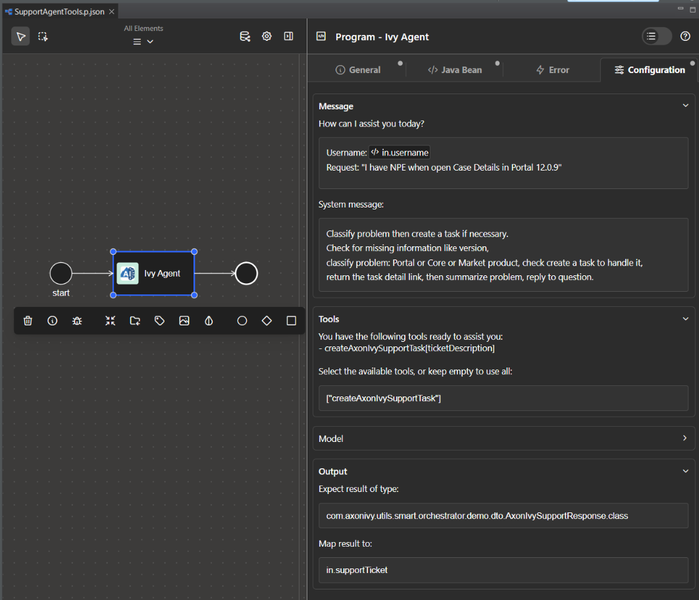
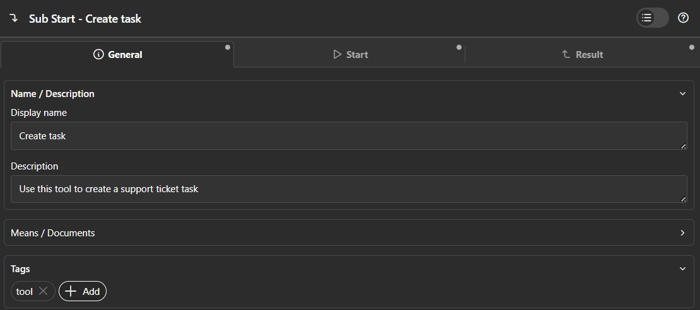
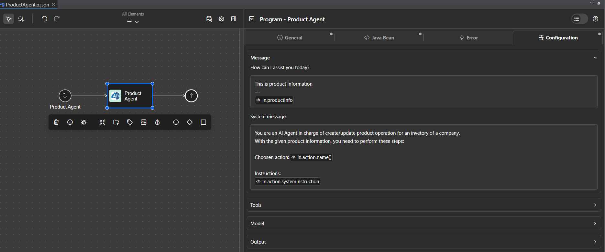
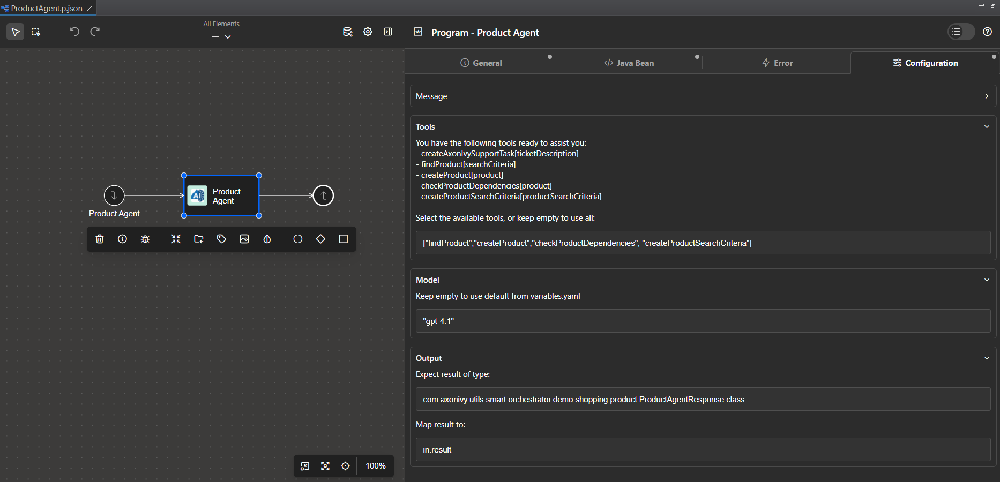

# Intelligenter Workflow

**Smart Workflow** bringt KI direkt in Axon Ivy, sodass Entwickler KI-Agenten
innerhalb bestehender Axon-Prozesse erstellen, ausführen und verbessern können.
Damit können Geschäftsabläufe große Sprachmodelle nutzen, um natürliche Sprache
zu verstehen, autonome Entscheidungen zu treffen und sich an veränderte
Anforderungen anzupassen – und das alles ohne umfangreiche architektonische
Änderungen.

Die wichtigsten Vorteile von Smart Workflow:

- **Vertraute Einrichtung:** Fügen Sie KI-Agenten ohne strukturelle Änderungen
  in BPMN-Prozesse ein und konfigurieren Sie alles über die
  Standardschnittstellen von Axon Ivy.
- **Unternehmensfähig:** Entwickelt für Unternehmensanforderungen mit
  Protokollierung, Überwachung und Konfigurationskontrollen.
- **Flexible Tools:** Verwandeln Sie jeden aufrufbaren Prozess in ein
  KI-erkennbares Tool.
- **Unterstützung mehrerer Modelle:** Verwenden Sie je nach Aufgabe einfache
  oder erweiterte Modelle.
- **Typsichere Ausgaben:** Erstellen Sie strukturierte Java-Objekte aus
  KI-Antworten zur sofortigen Verwendung.
- **Umgang mit natürlicher Sprache:** Akzeptiert unstrukturierte Eingaben und
  gibt menschenfreundliche Ausgaben zurück.

**Haftungsausschluss**

Dieser Konnektor wird als Alpha-Version **** bereitgestellt und ist nur für
Test- und Evaluierungszwecke vorgesehen. Er kann Fehler, unvollständige
Funktionen oder andere Probleme enthalten, die die Stabilität, Leistung oder
Funktionalität beeinträchtigen können. Die Verwendung dieses Konnektors erfolgt
auf eigene Gefahr.

Der Benutzer „ **“ ist allein verantwortlich** für die Konfiguration,
Bereitstellung und den Betrieb der KI und der damit verbundenen Agenten. Alle
Entscheidungen, Handlungen oder Ergebnisse, die sich aus der Verwendung dieses
Konnektors ergeben, liegen vollständig in der Verantwortung des Benutzers.

Wir stellen lediglich die technische Funktion „ **“ (** ) zur Verfügung, um
solche Konfigurationen zu ermöglichen, und lehnen ausdrücklich jegliche Haftung
für Missbrauch, Fehlkonfigurationen oder unbeabsichtigte Folgen, die sich aus
ihrer Verwendung ergeben, ab. Durch die Verwendung dieses Konnektors erkennen
Sie diese Einschränkungen an und akzeptieren sie.

## Demo

### Axon Ivy Support Agent Demo

Diese Demo zeigt, wie Sie den Axon Ivy Support Agent verwenden, einen
KI-gestützten Agenten, der in einen Geschäftsworkflow integriert ist. Der Agent
wurde entwickelt, um Supportprobleme zu klassifizieren, auf fehlende
Informationen zu prüfen und automatisch Supportaufgaben zu erstellen.

**Übersicht über den Arbeitsablauf:**

1. **Eingabe:** Der Agent erhält eine Support-Anfrage und den Benutzernamen des
   Meldenden.
2. **Klassifizierung:** Es analysiert das Problem, stellt fest, ob Informationen
   fehlen (z. B. die Version), und klassifiziert das Problem (Portal, Core oder
   Market-Produkt).
3. **Aufgabenerstellung:** Falls erforderlich, erstellt der Agent eine
   Support-Aufgabe mit dem Tool `createAxonIvySupportTask` und stellt einen Link
   zur erstellten Aufgabe bereit.
4. **Zusammenfassung und Antwort:** Der Agent fasst das Problem zusammen und
   antwortet dem Benutzer mit einer detaillierten Antwort.

**Technische Details:**

- Der Agent ist als aufrufbarer Unterprozess implementiert
  (`AxonIvySupportAgent.p.json`) und verwendet die Java-Bean
  `com.axonivy.utils.smart.workflow.AgenticProcessCall`.
- Der Agent ist so konfiguriert, dass er ein bestimmtes Tool verwendet
  (`createAxonIvySupportTask`), mit dem er automatisch Support-Aufgaben
  innerhalb des Workflows erstellen kann. Dies wird durch die Angabe des
  Toolnamens in der Konfiguration des Agenten erreicht (siehe Beispiel unten).
- Die Ausgabe des Agenten wird einem strukturierten Java-Objekt zugeordnet
  (`AxonIvySupportResponse`), sodass das KI-generierte Ergebnis direkt in Axon
  Ivy-Prozessen verwendet werden kann. Dieses Objekt enthält in der Regel
  Details wie die Klassifizierung, den Link zur erstellten Aufgabe und eine
  Zusammenfassung des Support-Problems.

**Beispiel für die Konfiguration des Agenten:**

Um den Agenten zu konfigurieren, definieren Sie ein Programmelement mit den
folgenden Einstellungen:



Diese Konfiguration stellt sicher, dass der Agent nur das angegebene Tool
verwendet und dessen Ausgabe als strukturiertes Java-Objekt zurückgibt.

**Beispiel für einen Demolauf:**

Angenommen, ein Benutzer reicht eine Support-Anfrage ein: „Ich habe einen NPE,
wenn ich Case Details in Portal 12.0.9 öffne.“

1. Der Agent erhält die Frage und den Benutzernamen.
2. Er überprüft, ob Informationen fehlen (z. B. Version), stuft das Problem als
   Portalproblem ein und legt fest, dass eine Support-Aufgabe erstellt werden
   sollte.
3. Der Agent ruft das Tool „ `createAxonIvySupportTask` “ auf, das eine neue
   Support-Aufgabe erstellt und einen Link dazu zurückgibt.
4. Der Agent fasst das Problem zusammen und gibt eine Antwort wie
   beispielsweise:

```text
Classification: Portal
Summary: The problem is a NullPointerException (NPE) occurring when opening Case Details in Portal version 12.0.9. Since the issue is related to the Portal product and the version is provided, a support task has been created to address this problem.
```

Diese Antwort wird dem Objekt „ `” „AxonIvySupportResponse” „` ” zugeordnet und
kann direkt in nachfolgenden Workflow-Schritten verwendet werden.

So führen Sie die Demo aus:

1. Stellen Sie sicher, dass Sie den Abschnitt [Konfigurationen](#configurations)
   ausgefüllt haben.
2. Starten Sie den Axon Ivy Support Agent-Prozess mit einer Support-Frage und
   einem Benutzernamen.
3. Überprüfen Sie die Antwort des Agenten, die eine Klassifizierung, die
   Erstellung einer Aufgabe (falls erforderlich) und eine Zusammenfassung
   enthält.

### Shopping-Demo

Diese Demo zeigt, wie KI die Abläufe eines kleinen E-Commerce-Modegeschäfts
verändern kann. Sie ist fortgeschrittener und kombiniert zwei Mini-Demos: eine
zur Produktgestaltung und eine zur semantischen Suche. Aufgrund ihrer
Komplexität werden wir hier nicht auf den detaillierten Code oder
Schritt-für-Schritt-Anleitungen eingehen. Wenn Sie sich mit der Implementierung
befassen möchten, sehen Sie sich bitte das Demo-Projekt „ `” unter
smart-workflow-demo` an.

**Produkterstellung**

Traditionell muss der Shopbetreiber beim Hinzufügen eines Produkts viele Felder
manuell ausfüllen und abhängige Datensätze (Lieferant, Marke, Kategorie)
validieren oder erstellen. Bei einem kleinen Shop kann dieser Vorgang Stunden
oder sogar einen ganzen Tag dauern: manuelle Dateneingabe, Suche nach fehlenden
Informationen und erneute Überprüfung auf Fehler.

Mit Smart Workflow-Agenten importiert der Bediener einfach die
Produktspezifikationen und Bilddateien. Die Agenten übernehmen das Parsen, die
Validierung, die Auflösung von Abhängigkeiten und die Produkterstellung –
wodurch der manuelle Aufwand und die Zeit bis zur Veröffentlichung erheblich
reduziert werden.

Entwickler müssen vier Agenten erstellen.

1. Produktagent

- Eingabe: geparste Produktspezifikation
- Tools:
  - Produkt suchen: Produkt im System suchen
  - Produkt erstellen: Erstellen Sie ein neues Produkt anhand der
    bereitgestellten Spezifikation.
  - Überprüfen Sie die Produktabhängigkeiten: Rufen Sie andere Agenten an, um
    Abhängigkeiten (Lieferant, Marke und Kategorie) zu finden und zu validieren.

2. Lieferantenvertreter

- Eingabe: Lieferanteninformationen
- Tools:
  - Lieferanten suchen: Lieferanten im System suchen
  - Lieferanten anlegen: Legen Sie anhand der bereitgestellten Informationen
    einen neuen Lieferanten an.

3. Kategorie-Agent

- Eingabe: Produktkategorie-Informationen
- Tools:
  - Kategorie suchen: Kategorie im System suchen
  - Kategorie erstellen: Erstellen Sie anhand der bereitgestellten Informationen
    eine neue Kategorie.

4. Markenvertreter

- Eingabe: Produktmarkeninformationen
- Tools:
  - Marke suchen: Marke im System suchen
  - Marke erstellen: Erstellen Sie anhand der bereitgestellten Informationen
    eine neue Marke.

Demo flow

1. Der Betreiber lädt Produktspezifikationen und Bilddateien hoch.
2. Smart Workflow analysiert die Dateien und extrahiert Produktattribute (Titel,
   SKU, Beschreibung, Preis, Lieferanteninformationen, Marke, Kategorie,
   Bilder).
3. Validatoren überprüfen Semantik und Einschränkungen (Pflichtfelder, Formate,
   Eindeutigkeit der SKU, Bildanforderungen).
4. Für jede Abhängigkeit (Lieferant, Marke, Kategorie) fragt Smart Workflow den
   entsprechenden Agenten: Wenn die Entität existiert → ID zurückgeben, wenn sie
   fehlt → anhand der bereitgestellten Spezifikation erstellen.
5. Der Produktagent erstellt das Produkt mit validierten Attributen und Links zu
   Abhängigkeits-IDs.
6. Das System gibt eine Zusammenfassung zurück und öffnet optional einen
   Bildschirm zur manuellen Überprüfung mit vorausgefüllten Feldern für die
   endgültige Freigabe.

Der neue KI-gestützte Prozess führte zu weniger Fehlern, deutlich weniger
manuellem Aufwand und einer wesentlich schnelleren Veröffentlichung.

**Semantische Suche**

Vor der Einführung der KI gaben Käufer Suchbegriffe wie „rotes Kleid“ ein,
wendeten dann manuell Filter (Preis, Marke, Kategorie) an und durchsuchten die
Ergebnisse. Dieser Prozess war nicht nur langsam und unflexibel, sondern
erfasste oft auch keine Synonyme, Stile oder Absichten (z. B. Party vs. Arbeit).

Bei der semantischen Suche spricht oder tippt der Benutzer eine natürliche
Anfrage ein. Die KI versteht die Absicht und die Einschränkungen (Farbe, Preis,
Anlass, Dringlichkeit) und wandelt diese in ein strukturiertes Kriterienobjekt
um. Das Backend wandelt dieses Objekt dann in SQL-Prädikate um und gibt
übereinstimmende Ergebnisse zurück. Bietet Erklärbarkeit, vertraute Tools und
eine einfachere Bereitstellung.

Entwickler müssen ein zusätzliches `Tool „Produkt nach Kriterien finden”` zum
`Produkt-Agenten` hinzufügen, wobei die Eingabe die Suchkriterien sind.

Demo flow

1. Käufer: tippt oder sagt „Ich brauche ein rotes Kleid für 100 Dollar für eine
   Party heute Abend.“
2. `Der Produktagent` extrahiert Attribute und erweitert die Abfrage (Synonyme,
   akzeptable Preisspanne: 80–120 $).
3. Axon Ivy Business Data wandelt Kriterien in optimierte Filter und
   Suchanfragen für die Produkte um.
4. Geben Sie die Top-Produkte zurück, die den Kriterien entsprechen.

Um die Demodaten schnell einzurichten, führen Sie den Prozess „ `“ aus.
Erstellen Sie Daten für die Shopping-Demo „` “ aus der Prozessliste.

## Setup

Um Ihre AI-Initiative zu starten, müssen wir die Modelle und Werkzeuge im Voraus
definieren.

### Models

Smart Workflow ist nicht an einen bestimmten KI-Anbieter gebunden. Sie können
Ihre bevorzugten Modellanbieter zum Installationszeitpunkt auswählen.

Nach der Installation wählen Sie bitte Ihren Standardmodellanbieter

Die Auswahl Ihres Anbieters erfolgt mit der Variablen `AI.DefaultProvider`.
Darüber hinaus benötigen die meisten Modellanbieter eine ApiKey oder eine andere
eindeutige Kennung. Überprüfen Sie Ihren Anbieter unten, um zu sehen, welche
Variablen zusätzlich gesetzt werden müssen.

```yaml
@variables.yaml@
```

#### OpenAI-Modelle

OpenAI-Modelle werden nativ unterstützt. Wenn Sie diese verwenden möchten,
importieren Sie das Projekt „ `” smart-workflow-openai` und definieren Sie Ihren
OpenAI-Schlüssel.

```yaml
@variables.openai@
```

#### Azure OpenAI-Modelle

Azure OpenAI-Modelle werden unterstützt. Um Azure OpenAI zu verwenden,
importieren Sie das Projekt „ `” smart-workflow-azure-openai`, konfigurieren Sie
Ihren Azure OpenAI-Endpunkt und Ihre Bereitstellungen.

Jede Bereitstellung in Azure OpenAI stellt eine Modellinstanz mit einem eigenen
API-Schlüssel dar. Sie können mehrere Bereitstellungen konfigurieren, um
verschiedene Modelle für unterschiedliche Aufgaben zu verwenden.

```yaml
@variables.azureopenai@
```

Beispiel Konfiguration:

```yaml
@variables.azureopenai.example@
```

#### Google Gemini-Modelle

Google Gemini Modelle werden unterstützt. Um Google Gemini zu verwenden,
importieren Sie das `smart-workflow-gemini`-Projekt und konfigurieren Sie Ihren
Gemini API-Schlüssel und Standardmodell. Dieser Anbieter unterstützt nicht die
strukturierte Ausgabefunktion, da Google Gemini-Modelle keine strukturierten
JSON-Reaktionen unterstützen.

```yaml
@variables.gemini@
```

Beispiel Konfiguration:

```yaml
@variables.gemini.example@
```

Um Unterstützung für zusätzliche AI-Modellanbieter zu verlangen, öffnen Sie
bitte ein GitHub Issue oder PR.

Stellen Sie sicher, dass Sie der [Models Contribution
Guideline](../doc/MODELS.md) folgen, um Ihren Anbieter auf das Smart
Workflow-Ökosystem auszurichten.

### Guardrails

Guardrails protect AI agents by validating user input before it reaches the
model. Smart Workflow includes a built-in `PromptInjectionGuardrail` that blocks
common prompt injection attacks.

#### Configuring Default Guardrails

Set default guardrails in `variables.yaml`:

```yaml
Variables:
  AI:
    Guardrails:
      # Comma-separated list of guardrail names
      DefaultInput: PromptInjectionGuardrail
```

#### Using Guardrails in Agents

In the agent configuration, specify guardrails as a String array:

```java
["PromptInjectionGuardrail", "MyCustomGuardrail"]
```

If no guardrails are specified, the agent uses the default guardrails from
`variables.yaml`.

Smart Workflow also lets you implement custom guardrails and handle guardrail
errors. For more details, see the [Guardrails Guideline](../doc/GUARDRAILS.md).

### Definition von Tools mit aufrufbaren Prozessen

Um effektiv zu funktionieren, benötigen KI-Agenten Tools zur Ausführung von
Aufgaben. Mit Smart Workflow ist die Erstellung eines Tools ganz einfach:
Definieren Sie einfach einen aufrufbaren Prozess und fügen Sie ihm das Tag „
`-Tool“` hinzu.

Um das geeignete Tool auszuwählen, stützen sich KI-Agenten auf die
Beschreibungen der aufrufbaren Prozesse. Um eine effiziente Tool-Auswahl zu
gewährleisten, beschreiben Sie den Zweck des Tools klar und deutlich im Feld „
`-Beschreibung“`.



### Definition des KI-Agenten

Um einen KI-Agenten zu definieren, erstellen Sie ein Programmelement, das auf
dem Java-Bean „ `com.axonivy.utils.smart.workflow.AgenticProcessCall` ” basiert.
Auf der Registerkarte „ `Configuration` ” können Sie detaillierte Einstellungen
für Ihren KI-Agenten aufrufen und anpassen.

#### Nachricht

Im Abschnitt „ `-Nachricht“ (` ) können Sie die Benutzernachricht und die
Systemnachricht für den Agenten festlegen. Durch die Möglichkeit, Code direkt in
diese Felder einzufügen, bietet Smart Workflow Entwicklern eine bequeme
Möglichkeit, Nachrichten zu definieren, bevor sie an den KI-Dienst gesendet
werden.



#### Tools

Unterhalb des Abschnitts „ `Messages“ (Nachrichten für „ “)` befindet sich der
Abschnitt „ `Tools“ (Tools für „ “)`, in dem Sie die Tools, die der Agent
verwenden soll, als String-Array definieren können. Beispiel:

```java
["findProduct","createProduct","checkProductDependencies", "createProductSearchCriteria"]
```

Wenn keine Tools angegeben sind, geht Smart Workflow standardmäßig davon aus,
dass der Agent alle verfügbaren Tools verwenden kann. Daher wird empfohlen, für
jeden Agenten einen bestimmten Satz von Tools zu definieren, um die
Reaktionsgeschwindigkeit zu verbessern und die Verwendung ungeeigneter Tools zu
verhindern.

#### Modell

Nicht alle KI-Agenten sind gleich. Bei Axon Ivy wissen wir, dass KI-Agenten
Aufgaben unterschiedlicher Komplexität bearbeiten. Einige Agenten führen
einfache Aufgaben aus, wie z. B. das Erstellen von Urlaubsanträgen oder das
Sammeln von Benutzerinformationen, während andere Datenbanken nach Produkten
durchsuchen und Abhängigkeiten wie Lieferanten und Marken bewerten müssen. Daher
ermöglicht Smart Workflow Entwicklern, das zugrunde liegende KI-Modell basierend
auf dem Anwendungsfall auszuwählen.

Geben Sie dazu einfach das gewünschte KI-Modell in den Abschnitt „ `-Modell“`
ein. Wenn kein Modell angegeben ist, verwendet Smart Workflow standardmäßig das
in der Variablen „ `“ definierte Modell AI.OpenAI.Model`.

#### Ausgabe

Bei KI-Anwendungen auf Unternehmensebene ist es üblich, dass das Ergebnis des
KI-Agenten in Form eines nutzbaren Objekts vorliegt. Um diesem Bedarf gerecht zu
werden, kann der Smart Workflow KI-Agent die Ausgabe als Java-Objekt erstellen,
das direkt von Axon Ivy-Prozessen verwendet werden kann.

Sie können dies ganz einfach konfigurieren, indem Sie sowohl den erwarteten
Ergebnistyp als auch das Zielobjekt, dem das Ergebnis zugeordnet werden soll, im
Abschnitt „ `-Ausgabe` “ angeben.


